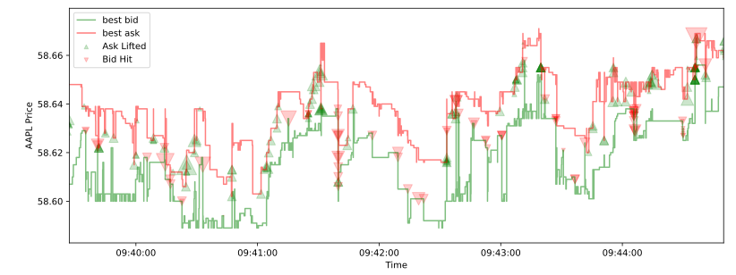

[](https://github.com/wingfoil-io/wingfoil/actions/workflows/rust-test.yml)
[](https://codecov.io/gh/wingfoil-io/wingfoil)
[](https://crates.io/crates/wingfoil)
[](https://docs.rs/wingfoil/)
[](https://pypi.org/project/wingfoil/)
[](https://www.npmjs.com/package/@wingfoil/client)
[](https://wingfoil.readthedocs.io/en/latest/)
[](LICENSE.txt)
[](https://discord.gg/rfGqf3Ff)

# Wingfoil

Wingfoil is a [blazingly fast](crates/wingfoil/benches/) stream processing
engine for latency-critical systems such as electronic trading and real-time AI.

Wire a graph of calculations once and Wingfoil runs it — interpreted, compiled
into a single monomorphized function, or as compiled islands inside an
interpreted graph. Backtest it over history, then run it live without changing
the wiring.

It ships with sixteen production-ready adapters covering tick stores, message
buses, market protocols and observability backends, so graphs plug into real
data sources and sinks in a line.


## Features

- **Fast**: [~27 ns](#performance) of engine overhead per node cycle, from a
  topologically sorted [DAG](https://en.wikipedia.org/wiki/Directed_acyclic_graph)
  execution engine that visits each node once per tick.
- **Three execution tiers, one wiring**: [interpreted, compiled, or a compiled
  island](#execution-tiers) — all derived from the same definition, so they
  cannot drift. Compiled runs [4.4×–37× faster](#performance).
- **Backtesting**: [replay historical data](crates/wingfoil/examples/core/run_mode/)
  deterministically off source-driven engine time, then run the identical graph
  live. Same-instant values ride a single burst — never coalesced, never
  latest-wins, never dropped, in either mode.
- **Adapters**: [PostgreSQL, KDB+, Kafka, Redis, etcd, Fluvio, ZeroMQ, FIX 4.4,
  iceoryx2, Aeron, WebSocket, Prometheus, OpenTelemetry, CSV, augurs and
  line-oriented files](crates/wingfoil/examples/adapters/) — one runnable
  example each.
- **Latency tracing**: [per-hop wall-clock stamps](crates/wingfoil/examples/showcase/)
  aggregating into one report, across shared memory and the wire.
- **Multi-language**: a [Rust crate](https://crates.io/crates/wingfoil/), a
  [Python package](crates/wingfoil-python/) and a
  [TypeScript client](js/).
- **Graph dynamism**: [add and remove nodes](crates/wingfoil/examples/core/dynamism/)
  on a running graph, between cycles.
- **Async/Tokio**: [seamless integration](crates/wingfoil/examples/core/async/)
  at your graph edges.
- **Multi-threading**: [distribute graph execution](crates/wingfoil/examples/core/threading/)
  across cores, with no locks on the graph execution path.
- **Errors are values**: every lifecycle function returns a `Result`; a producer
  error propagates into the graph and aborts the run with context.
- **Extensible without forking**: sources, combinators, statistics and adapters
  are extension traits, and your own ops get interpreted *and* compiled coverage
  from `#[op]`.


## Quick Start

```sh
cargo add wingfoil            # Rust
pip install wingfoil          # Python
npm install @wingfoil/client  # TypeScript client for the web adapter
```

A simple linear pipeline, with all nodes ticking in lock-step:

```rust
use std::time::Duration;
use wingfoil::{RunFor, RunMode};
use wingfoil::prelude::*;

fn main() {
    GraphBuilder::new()
        .ticker(Duration::from_secs(1))
        .count()
        .map(|i| format!("hello, world {i}"))
        .print()
        .build()
        .run(RunMode::RealTime, RunFor::Cycles(3))
        .unwrap();
}
```

This output is produced:

```pre
hello, world 1
hello, world 2
hello, world 3
```


## Order Book Example

Wingfoil lets you wire up complex business logic, splitting and recombining
streams and modulating the frequency of data. Adapters make it easy to plug in
real data sources and sinks. Here we load a CSV of AAPL limit orders, maintain
an order book with the lobster crate, derive trades and two-way prices, and
export both back to CSV:

```rust,ignore
let book = RefCell::new(lobster::OrderBook::default());
let get_time = |msg: &Message| NanoTime::new((msg.seconds * 1e9) as u64);

let g = GraphBuilder::new();
let (fills, prices) = csv_read(&g, &source_path, get_time, true, None)?
    .map(move |chunk: &Burst<Message>| process_orders(chunk, &book))
    .split();

let _prices_sink = prices.filter_none().distinct().csv_write(&prices_path)?;
let _fills_sink = fills.csv_write(&fills_path)?;

g.build().run(RunMode::HistoricalFrom(NanoTime::ZERO), RunFor::Forever)?;
```

The frequencies of the inputs and outputs are all different to each other —
messages arrive in same-timestamp bursts, the top of book changes less often,
and trades are sparser still. This output is produced:

<div align="center">
  
</div>

An hour of market data — 91,998 messages — replays in about a tenth of a
second. [Full example.](crates/wingfoil/examples/core/order_book/)


## Execution tiers

One wiring function, wrapped in `nitro! { fn my_graph(g: &GraphBuilder) -> ... }`,
expands to a module offering all three tiers:

| Tier | Entry point | What it is |
|---|---|---|
| Interpreted | fluent chaining directly, or `my_graph::interpreted()` | One dyn boundary per op; open world — threaded/busy-poll sources, feedback, bursts. |
| Compiled | `my_graph::compiled(run_mode, run_for)` | The whole graph monomorphized into one function, state in locals — fastest, static DAGs. |
| Nested (island) | `my_graph::nested(&g, inputs...)` | A compiled sub-graph mounted as one node of an interpreted graph — hot core compiled, edges stay open. |

Semantics live once, in each op's `cycle` function — the tiers differ only in
how the engine reaches it, so there is no duplicated execution logic behind
those three doors. [`core/dual_mode`](crates/wingfoil/examples/core/dual_mode/)
has the rules governing what a `nitro!` wiring accepts.


## Performance

Read the **ratios**, not the absolute times: these were captured on shared
4-core cloud VMs, each comparison measured back to back in the same run. Full
method, caveats and per-workload tables:
[`benches/README.md`](crates/wingfoil/benches/README.md).

| | Measurement |
|---|---|
| Engine overhead per node cycle | **~27 ns** (10×10 graph, 100 nodes, every node ticking every cycle) |
| Compiled vs interpreted | **4.4×–37× faster** across eight workloads |
| Nested island vs interpreted | **2.2×–10.2× faster** |
| Interpreted vs the legacy engine | **0.56×–0.84×** — the port is faster on all eight |
| vs rxrust / tokio async streams | **~79× / ~134× faster** at depth 10, and the gap grows with depth |

Wingfoil visits every node once per tick, in topological order. Libraries that
propagate along one path at a time re-visit shared nodes once per path — so on a
branch-and-recombine graph their cost doubles with every level while Wingfoil's
stays flat. [`core/topological_sort`](crates/wingfoil/examples/core/topological_sort/)
explains the mechanism in 40 lines.


## Examples

46 runnable examples, each in its own directory with a README covering what it
teaches, the wiring, and its expected output. Full index:
[`examples/README.md`](crates/wingfoil/examples/README.md).

If you are new, run these three in order — they cover the whole model between
them:

```sh
cargo run --manifest-path crates/wingfoil/Cargo.toml --example hello_graph   # wire → build → run
cargo run --manifest-path crates/wingfoil/Cargo.toml --example ema_crossover # fold/join/map/filter at backtest scale
cargo run --manifest-path crates/wingfoil/Cargo.toml --features csv --example order_book
```

Then pick a direction: [`adapters/`](crates/wingfoil/examples/adapters/) to plug
in real data, [`core/dual_mode`](crates/wingfoil/examples/core/dual_mode/) for
the execution tiers, [`core/run_mode`](crates/wingfoil/examples/core/run_mode/)
to backtest, or [`showcase/`](crates/wingfoil/examples/showcase/) for end-to-end
latency tracing across processes.


## Links

- Explore the [examples](crates/wingfoil/examples/)
- Browse the [crates](crates/)
- Read the [benchmarks](crates/wingfoil/benches/)
- Use it from Python: [`wingfoil-python`](crates/wingfoil-python/)
- Use it from the browser: [`@wingfoil/client`](js/)
- See [CONTRIBUTING](CONTRIBUTING.md) to build, test and contribute


## Get Involved!

We want to hear from you! Especially if you:
- are interested in [contributing](CONTRIBUTING.md)
- know of a project that Wingfoil would be well-suited for
- would like to request a feature or report a bug
- have any feedback

Please do get in touch:
- ping us on [discord](https://discord.gg/rfGqf3Ff)
- email us at [hello@wingfoil.io](mailto:hello@wingfoil.io)
- submit an [issue](https://github.com/wingfoil-io/wingfoil/issues)
- get involved in the [discussion](https://github.com/wingfoil-io/wingfoil/discussions/)
