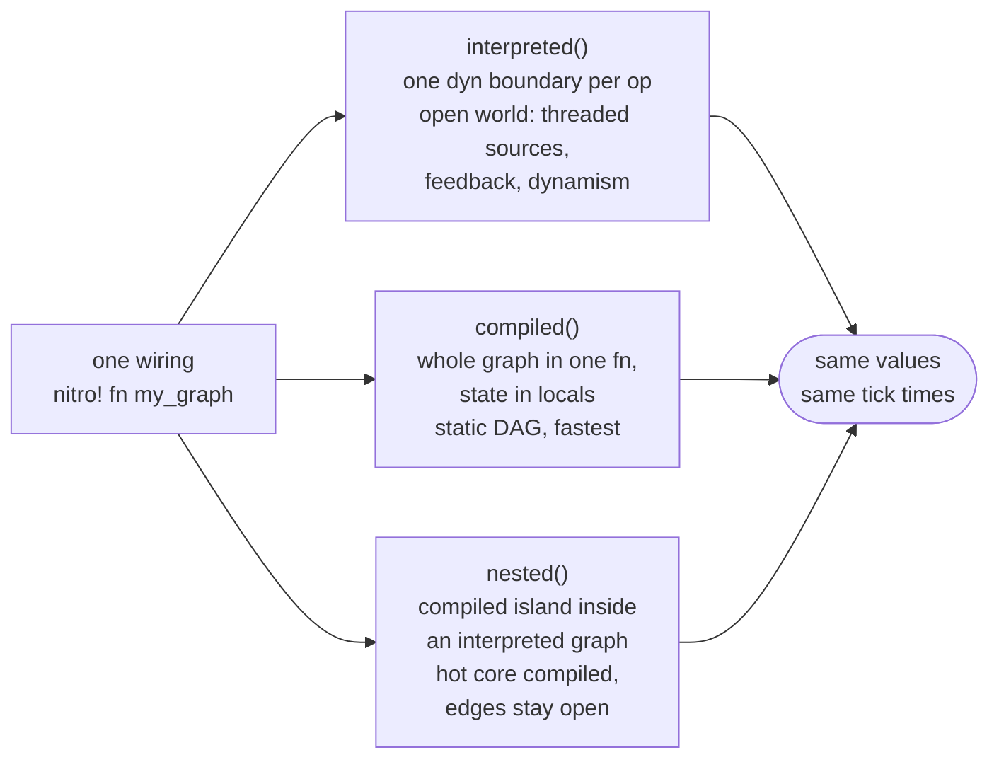

[](https://github.com/wingfoil-io/wingfoil/actions/workflows/rust-test.yml)
[](https://codecov.io/gh/wingfoil-io/wingfoil)
[](https://crates.io/crates/wingfoil)
[](https://docs.rs/wingfoil/)
[](https://pypi.org/project/wingfoil/)
[](https://www.npmjs.com/package/@wingfoil/client)
[](https://wingfoil.readthedocs.io/en/latest/)
[](LICENSE.txt)
[](https://discord.gg/rfGqf3Ff)

# Wingfoil

**A stream processing engine for latency-critical systems.** Wire a graph of
calculations once; run it interpreted, compile it into a single monomorphized
function, or mount compiled islands inside an interpreted graph — from the
same definition. Backtest it over history, then run it live without changing
the wiring.

Built for electronic trading and real-time AI, in Rust, with
[Python](crates/wingfoil-python/) and [TypeScript](js/) on top.

```rust
use std::time::Duration;
use wingfoil::{RunFor, RunMode};
use wingfoil::prelude::*;

fn main() {
    GraphBuilder::new()
        .ticker(Duration::from_secs(1))
        .count()
        .map(|i| format!("hello, world {i}"))
        .print()
        .build()
        .run(RunMode::RealTime, RunFor::Cycles(3))
        .unwrap();
}
```

```pre
hello, world 1
hello, world 2
hello, world 3
```

```sh
cargo add wingfoil          # Rust
pip install wingfoil        # Python
npm install @wingfoil/client  # TypeScript client for the web adapter
```

> New here? Run three examples in order — they cover the whole model between
> them: [`hello_graph`](crates/wingfoil/examples/core/hello_graph/) →
> [`ema_crossover`](crates/wingfoil/examples/core/ema_crossover/) →
> [`order_book`](crates/wingfoil/examples/core/order_book/). Commands are
> [below](#start-here).


## Why Wingfoil

- **Three execution tiers, one wiring.** Interpreted for an open, dynamic
  world; `compiled()` for a static DAG monomorphized into one function; or
  compiled islands `nested()` inside an interpreted graph. Every tier is
  derived from the same definition, so they cannot drift — there is no
  duplicated execution logic anywhere. Compiled runs
  [4.4×–37× faster](#performance) than interpreted.
- **Backtest and live are the same graph.** `RunMode::HistoricalFrom` replays
  deterministically off source-driven engine time — no clock is consulted at
  all — and `RunMode::RealTime` runs the identical wiring. Same code, same
  results.
- **Lossless by construction.** Same-instant values ride a single burst —
  never coalesced, never latest-wins, never dropped — identically in realtime
  and in replay.
- **Sixteen adapters.** PostgreSQL, KDB+, Kafka, Redis, etcd, Fluvio, ZeroMQ,
  FIX 4.4, iceoryx2, Aeron, WebSocket, Prometheus, OpenTelemetry, CSV, augurs
  and line-oriented files — async/Tokio at your graph edges, plus an LRU file
  cache for time-sliced readers. One runnable example each,
  [indexed here](crates/wingfoil/examples/adapters/). Three of them —
  **iceoryx2, Aeron, and FIX in its spin mode** — poll from the graph thread and
  belong on a latency-critical path; the rest reach the graph through a
  background task and an OS wakeup, which is the right shape for what those
  transports are and not a microsecond path.
- **Latency tracing that survives a process hop.** Per-hop wall-clock stamps
  aggregating into one report, across shared memory and the wire — see
  [`showcase/`](crates/wingfoil/examples/showcase/). `count`, `min`, `mean` and
  `max` are exact; percentiles come off a sub-bucketed histogram and are
  accurate to 3.125%.
- **Fallible everywhere.** Every lifecycle function returns a `Result`; a
  producer error propagates into the graph and aborts the run with context,
  and cleanup still runs.
- **Dynamic when you need it.** Add and remove nodes on a
  [running graph](crates/wingfoil/examples/core/dynamism/), between cycles.
- **Multi-threaded.** Distribute graph execution across threads through the
  channel layer, with no locks on the graph execution path.
- **Extensible without forking.** Add sources, combinators, statistics and
  adapters as extension traits; your own ops get interpreted *and* compiled
  coverage from `#[op]`, with no macro table to edit.


## A Worked Example

The chain above builds and runs in one expression — `build()` is available at
the end of a chain as well as on the `GraphBuilder`. Keep the builder and the
streams in bindings when you branch, or when you want to read values back
after the run (`runner.value(&stream)`), as here.

Wingfoil lets you wire up complex business logic, splitting and recombining
streams and modulating the frequency of data. Here a price stream is folded
into fast and slow EMAs, recombined into a crossover signal, and gated so it
only fires when the signal *changes*:

```rust,ignore
let g = GraphBuilder::new();
let price = g.ticker(Duration::from_millis(1)).map(next_price);

// Fast and slow EMAs over the same price stream, recombined into a signal.
let fast = price.fold((0.0, false), ema(0.30)).map(|s| s.0);
let slow = price.fold((0.0, false), ema(0.05)).map(|s| s.0);
let signal = fast.join(&slow, |f, s| f > s);

// Emit only when the crossover state changes.
signal
    .fold((false, false), |st, s| { st.0 = st.1; st.1 = *s; })
    .filter(|st| st.0 != st.1)
    .print();

let mut runner = g.build();
runner.run(RunMode::HistoricalFrom(NanoTime::ZERO), RunFor::Cycles(5_000)).unwrap();
```

See the full [`order_book`](crates/wingfoil/examples/core/order_book/) and
[`ema_crossover`](crates/wingfoil/examples/core/ema_crossover/) examples.


## Execution tiers

One wiring function, wrapped in `nitro! { fn my_graph(g: &GraphBuilder) -> ... }`,
expands to a module offering all three tiers:

| Tier | Entry point | What it is |
|---|---|---|
| Interpreted | fluent chaining directly, or `my_graph::interpreted()` | One dyn boundary per op; open world — threaded/busy-poll sources, feedback, bursts. |
| Compiled | `my_graph::compiled(run_mode, run_for)` | The whole graph monomorphized into one function, state in locals — fastest, static DAGs. |
| Nested (island) | `my_graph::nested(&g, inputs...)` | A compiled sub-graph mounted as one node of an interpreted graph — hot core compiled, edges stay open. |



There is no duplicated execution logic behind those three doors: semantics
live once, in each op's `cycle` function, and the tiers differ only in how the
engine reaches it. See
[`core/dual_mode`](crates/wingfoil/examples/core/dual_mode/) for the rules
governing what a `nitro!` wiring accepts.


## Performance

Read the **ratios**, not the absolute times — these were captured on shared
4-core cloud VMs, and each comparison is between bars measured back to back in
the same run. Full method, caveats, plots and per-workload tables:
[`benches/README.md`](crates/wingfoil/benches/README.md).

| | Measurement |
|---|---|
| Engine overhead per node cycle | **~27 ns** (10×10 graph, 100 nodes, every node ticking every cycle) |
| Reading the graph clock | **24.3 ns** — and a cycle in which nothing stamps latency never pays it |
| Compiled vs interpreted | **4.4×–37× faster** across eight workloads |
| Nested island vs interpreted | **2.2×–10.2× faster** |
| Interpreted vs the legacy engine | **0.56×–0.84×** — the port is faster on all eight |

The eight workloads span dense chains, fan-out, fan-in at widths 16/64/256,
accumulation and sparse graphs up to 781 nodes.

### Why a DAG engine, and not reactive streams

Wingfoil visits every node once per tick, in topological order. Libraries that
propagate along one path at a time re-visit shared nodes once per path — so on
a branch-and-recombine graph their cost **doubles with every level** while
Wingfoil's stays flat. Benchmarked head to head against rxrust and tokio async
streams, at depth 10:

| Engine | Per iteration | vs Wingfoil interpreted |
|---|---|---|
| Wingfoil, interpreted | 287.5 ns | 1× |
| rxrust | 22.595 µs | **~79× slower** |
| tokio async streams | 38.487 µs | **~134× slower** |

Against the compiled tier the same two gaps are 945× and 1610×, and Wingfoil
stays flat across all ten levels while both path-at-a-time libraries measured
2.01× and 1.94× per level.

At depth 20 the same slopes put the gap in the millions. Both multipliers are
stated conservatively — the
[method notes](crates/wingfoil/benches/README.md#topological-sort-vs-per-path-propagation)
list the caveats, and they cut against Wingfoil.
[`core/topological_sort`](crates/wingfoil/examples/core/topological_sort/)
explains the mechanism in 40 lines.


## Examples

46 runnable examples, each in its own directory with a README covering
what it teaches, the wiring, and its expected output. Full index:
[`examples/README.md`](crates/wingfoil/examples/README.md).

```sh
cargo run --manifest-path crates/wingfoil/Cargo.toml --example <name>                      # core examples
cargo run --manifest-path crates/wingfoil/Cargo.toml --example <name> --features <feature> # anything gated
```

### Start here

Three examples, in order — they cover the whole model between them.

```sh
cargo run --manifest-path crates/wingfoil/Cargo.toml --example hello_graph      # wire → build → run
cargo run --manifest-path crates/wingfoil/Cargo.toml --example ema_crossover    # fold/join/map/filter at backtest scale
cargo run --manifest-path crates/wingfoil/Cargo.toml --example order_book       # real state in fold
```

Then pick a direction: [`adapters/`](crates/wingfoil/examples/adapters/) to
plug in real data, [`core/dual_mode`](crates/wingfoil/examples/core/dual_mode/)
for the execution tiers, or [`core/run_mode`](crates/wingfoil/examples/core/run_mode/)
to backtest.

### Core concepts — [index](crates/wingfoil/examples/core/)

| Example | Description |
|---|---|
| [`hello_graph`](crates/wingfoil/examples/core/hello_graph/) | Smallest graph: a ticker counted and formatted, run historical (instant) then realtime. |
| [`ema_crossover`](crates/wingfoil/examples/core/ema_crossover/) | Backtest-shaped: a price walk, fast/slow EMAs, and golden/death-cross signals on state change. |
| [`order_book`](crates/wingfoil/examples/core/order_book/) | Maintain a limit order book in `fold` state, derive trades and two-way prices. |
| [`run_mode`](crates/wingfoil/examples/core/run_mode/) | Swap `RunMode::RealTime` and `RunMode::HistoricalFrom` with the same graph wiring. |
| [`topological_sort`](crates/wingfoil/examples/core/topological_sort/) | Why topologically sorted execution avoids the node explosion of walking a DAG one path at a time. |
| [`feedback`](crates/wingfoil/examples/core/feedback/) | Close a loop between nodes with a `feedback` channel — a control loop a plain DAG can't express. |
| [`statistics`](crates/wingfoil/examples/core/statistics/) | Streaming statistics toolkit — EWMA, cumulative and rolling mean/variance/std/min/max/median. |
| [`tracing`](crates/wingfoil/examples/core/tracing/) | The `logged` debug tap and the engine's spans — three instrumentation modes. |
| [`odds_evens`](crates/wingfoil/examples/core/odds_evens/) | Split a counter by parity into two branches and merge back — the split-and-recombine DAG, through `nitro!`. |
| [`dual_mode`](crates/wingfoil/examples/core/dual_mode/) | One `nitro!` wiring expands to both an interpreted and a fully compiled runner — and the rules governing what it accepts. |
| [`fanout_10x10`](crates/wingfoil/examples/core/fanout_10x10/) | A 10×10 fan-out graph expressed through `nitro!`, the benchmark shape. |
| [`threading`](crates/wingfoil/examples/core/threading/) | Run a producer sub-graph on its own thread, feeding the main graph over the channel layer. |
| [`spawn`](crates/wingfoil/examples/core/spawn/) | The same offload through the `spawn` / `spawn_map` combinators. |
| [`async`](crates/wingfoil/examples/core/async/) | Drive a graph from an async/Tokio producer at the graph edge. |
| [`async_source`](crates/wingfoil/examples/core/async_source/) | `external` sources — a tokio task pushing into a realtime graph, burst-delivered. |
| [`produce_async_feed`](crates/wingfoil/examples/core/produce_async_feed/) | `produce_async` — timestamped async values, so the same feed replays deterministically. |
| [`dynamic_group`](crates/wingfoil/examples/core/dynamism/dynamic_group/) | Add and remove nodes on a **running** graph, between engine cycles. |
| [`dynamic_manual`](crates/wingfoil/examples/core/dynamism/dynamic_manual/) | The same splicing driven by hand — `add_upstream` / `remove` from the `run_dynamic` hook. |
| [`demux_it`](crates/wingfoil/examples/core/dynamism/demux_it/) | The statically-wired counterpart — the same price book through a fixed slot pool. |
| [`demux_map`](crates/wingfoil/examples/core/dynamism/demux_map/) | The single-value demux: one routed value per cycle, and what that constrains. |
| [`demux_raw`](crates/wingfoil/examples/core/dynamism/demux_raw/) | The routing primitive underneath both, with the key→slot pool hand-rolled. |

### Adapters — [index](crates/wingfoil/examples/adapters/)

| Example | Feature | Description |
|---|---|---|
| [`lines`](crates/wingfoil/examples/adapters/lines/) | `async` | Dependency-free line-oriented file adapter — the smallest complete I/O edge. |
| [`csv`](crates/wingfoil/examples/adapters/csv/) | `csv` | Replay a CSV as a deterministic historical burst stream, transform each row, write back to CSV. |
| [`augurs`](crates/wingfoil/examples/adapters/augurs/) | `augurs` | On-graph forecasting, outlier / changepoint / season detection, DTW and clustering over sliding windows. |
| [`zmq`](crates/wingfoil/examples/adapters/zmq/) | `zmq` | Brokerless ZeroMQ pub/sub, with connection status as a stream. |
| [`kafka`](crates/wingfoil/examples/adapters/kafka/) | `kafka` | Kafka / Redpanda — consume, transform, produce. |
| [`fluvio`](crates/wingfoil/examples/adapters/fluvio/) | `fluvio` | Fluvio distributed streaming — subscribe, transform, publish. |
| [`redis`](crates/wingfoil/examples/adapters/redis/) | `redis` | Redis Pub/Sub — subscribe, transform, republish. |
| [`etcd`](crates/wingfoil/examples/adapters/etcd/) | `etcd` | Watch an etcd key prefix, transform values, and write the result back. |
| [`iceoryx2`](crates/wingfoil/examples/adapters/iceoryx2/) | `iceoryx2` | Zero-copy IPC over shared memory. |
| [`aeron`](crates/wingfoil/examples/adapters/aeron/) | `aeron` | Low-latency Aeron UDP/IPC, plus a status-driven circuit breaker. |
| [`kdb`](crates/wingfoil/examples/adapters/kdb/) | `kdb` | KDB+ — time-sliced reads, an LRU file cache, and a write/read/validate round trip. |
| [`postgres`](crates/wingfoil/examples/adapters/postgres/) | `postgres` | PostgreSQL — time-sliced historical reads and streaming writes. |
| [`fix`](crates/wingfoil/examples/adapters/fix/) | `fix` | FIX 4.4 loopback — acceptor and initiator in one process, no external engine. |
| [`web`](crates/wingfoil/examples/adapters/web/) | `web` | WebSocket — stream prices to a browser, receive UI events back. |
| [`prometheus`](crates/wingfoil/examples/adapters/prometheus/) | `prometheus` | Serve `/metrics` for scraping (pull). |
| [`otlp`](crates/wingfoil/examples/adapters/otlp/) | `otlp,prometheus` | Push over OTLP *and* serve `/metrics` (push + pull). |
| [`telemetry`](crates/wingfoil/examples/adapters/telemetry/) | — | The shared Docker harness (Prometheus, Grafana, Alloy) both exporters scrape into. |

### Showcase — [index](crates/wingfoil/examples/showcase/)

| Example | Description |
|---|---|
| [`latency`](crates/wingfoil/examples/showcase/latency/) | Per-hop latency stamping with `latency_stages!` and `Traced<T, L>`, across an iceoryx2 shared-memory hop. |
| [`latency_e2e`](crates/wingfoil/examples/showcase/latency_e2e/) | Nine stages, browser to venue and back — WebSocket → iceoryx2 → FIX/TLS, with Prometheus, Grafana and Tempo. |


## Links

- Explore the [examples](crates/wingfoil/examples/)
- Browse the [crates](crates/)
- Read the [benchmarks](crates/wingfoil/benches/)
- Use it from Python: [`wingfoil-python`](crates/wingfoil-python/)
- Use it from the browser: [`@wingfoil/client`](js/)
- See [CONTRIBUTING](CONTRIBUTING.md) to build, test and contribute


## Get Involved!

We want to hear from you! Especially if you:
- are interested in [contributing](CONTRIBUTING.md)
- know of a project that Wingfoil would be well-suited for
- would like to request a feature or report a bug
- have any feedback

Please do get in touch:
- ping us on [discord](https://discord.gg/rfGqf3Ff)
- email us at [hello@wingfoil.io](mailto:hello@wingfoil.io)
- submit an [issue](https://github.com/wingfoil-io/wingfoil/issues)
- get involved in the [discussion](https://github.com/wingfoil-io/wingfoil/discussions/)
