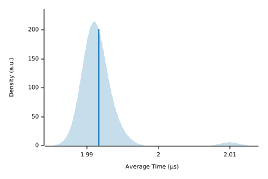

## 10x10

|                                                                                    |                                                           |
|------------------------------------------------------------------------------------|-----------------------------------------------------------|
|  |                        |

#### Additional Statistics:

|           | Lower bound | Estimate  | Upper bound |
|-----------|-------------|-----------|-------------|
| Slope     | 3.6040 µs   | 3.8619 µs | 4.1509 µs   |
| R²        | 0.1018924   | 0.1077417 | 0.1004953   |
| Mean      | 3.6585 µs   | 4.0375 µs | 4.6000 µs   |
| Std. Dev. | 788.28 ns   | 2.5129 µs | 4.0831 µs   |
| Median    | 3.3309 µs   | 3.5170 µs | 3.6486 µs   |
| MAD       | 414.58 ns   | 601.89 ns | 766.02 ns   |

#### Additional Plots:

-   [Typical](typical.svg)
-   [Mean](mean.svg)
-   [Std. Dev.](SD.svg)
-   [Median](median.svg)
-   [MAD](MAD.svg)
-   [Slope](slope.svg)

#### Understanding this report:

The plot on the left displays the average time per iteration for this
benchmark. The shaded region shows the estimated probability of an
iteration taking a certain amount of time, while the line shows the
mean. Click on the plot for a larger view showing the outliers.

The plot on the right shows the linear regression calculated from the
measurements. Each point represents a sample, though here it shows the
total time for the sample rather than time per iteration. The line is
the line of best fit for these measurements.

See [the
documentation](https://bheisler.github.io/criterion.rs/book/user_guide/command_line_output.html#additional-statistics)
for more details on the additional statistics.

This report was generated by
[Criterion.rs](https://github.com/bheisler/criterion.rs), a
statistics-driven benchmarking library in Rust.

