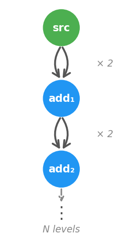

## Topological Sort vs Per-Path Propagation: Branch / Recombine Benchmark

Port of `legacy/wingfoil/benches/bfs_vs_dfs/README.md` onto the next engine.

These benchmarks measure the cost of the branch/recombine pattern at depths 1–10:



At depth N the graph has 2^N paths from source to sink. The execution model
determines whether a framework pays O(N) or O(2^N) per tick.

### Results


wingfoil stays flat while async streams and reactive double every level
(O(2^N) per-path propagation). Point estimates, in nanoseconds:

| Depth | wingfoil-next (topologically sorted) | rxrust (per-path) | tokio async streams (per-path) |
|---|---|---|---|
| 1  | 610 | 46 | 188 |
| 2  | 410 | 109 | 309 |
| 3  | 446 | 257 | 494 |
| 4  | 438 | 517 | 907 |
| 5  | 539 | 1 140 | 1 782 |
| 6  | 513 | 2 147 | 3 394 |
| 7  | 562 | 4 333 | 6 847 |
| 8  | 538 | 8 452 | 13 405 |
| 9  | 575 | 17 437 | 30 360 |
| 10 | 681 | 40 286 | 54 872 |

Both path-at-a-time libraries start out *ahead* — at depth 1 there is almost no
graph to schedule, and wingfoil is paying the bench harness's fixed handshake
(~677 ns of it; see [`../README.md`](../README.md#graph-overhead)). They cross
over by depth 4 and then double every level, while wingfoil is flat: **59×
(rxrust) and 81× (async streams)** behind by depth 10. Extending the same
slopes to depth 20 puts the gap in the millions.

This is a *reading*, not source — measured on the machine described in
[`../images/lscpu.txt`](../images/lscpu.txt). Regenerate it locally by running
the three targets and refilling `plot.py` (the script's header lists the
commands). The legacy-engine plot, on the same workload, is preserved at
[`legacy/wingfoil/benches/bfs_vs_dfs/latency.png`](../../../../legacy/wingfoil/benches/bfs_vs_dfs/latency.png)
until the Phase-7 cutover.

### Why the difference?

**Per-path propagation (reactive / async):** when a source ticks, it fires
both arms of `combine_latest(src, src)` independently. Each arm triggers the
next level, which again fires both arms — 2^N callbacks or awaits across N
levels.

**Topological sort (wingfoil):** the graph is sorted so that every node is
scheduled after everything it reads, and the scheduler visits each node
exactly once per tick regardless of how many upstream paths lead to it. The
entire depth-127 graph in the
[topological_sort example](../../examples/core/topological_sort/) completes in
a single engine cycle.

### Benchmarks

| File | Framework | Pattern |
|------|-----------|---------|
| [wingfoil.rs](wingfoil.rs) | wingfoil-next | `s.join(&s, \|a, b\| a + b)` via `add_bench` |
| [async_streams.rs](async_streams.rs) | tokio async/await | recursive `branch_recombine` |
| [reactive.rs](reactive.rs) | rxrust 1.0 | `Subject` chain + `combine_latest` |

Only the first row changes across the port — the other two measure *other
libraries* as comparison baselines and are engine-agnostic, so their code is a
verbatim copy of the legacy files (only the wording of their header comments
differs). `wingfoil.rs` keeps the legacy workload node-for-node; legacy's free
function `add(&a, &b)` (a `bimap` with both upstreams active) is next's
`join`, one node per level either way.

### Running

The bench targets keep their historical names:

```bash
cargo bench -p wingfoil-next --features bench --bench bfs_vs_dfs_wingfoil
cargo bench -p wingfoil-next --bench bfs_vs_dfs_reactive
cargo bench -p wingfoil-next --features async --bench bfs_vs_dfs_async_streams
```
