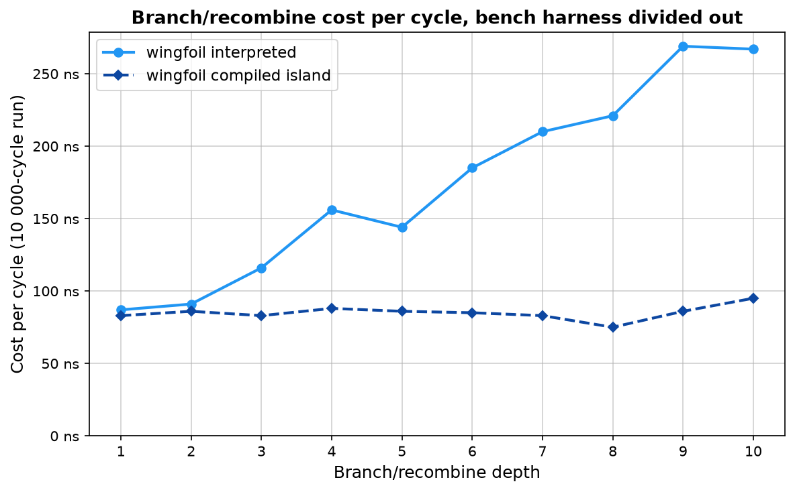

## Topological Sort vs Per-Path Propagation: Branch / Recombine Benchmark

Port of `legacy/wingfoil/benches/bfs_vs_dfs/README.md` onto the next engine.

These benchmarks measure the cost of the branch/recombine pattern at depths 1–10:


At depth N the graph has 2^N paths from source to sink. The execution model
determines whether a framework pays O(N) or O(2^N) per tick.

### Results


wingfoil stays flat while async streams and reactive double every level
(O(2^N) per-path propagation). Point estimates, in nanoseconds per tick:

| Depth | wingfoil-next interpreted | wingfoil-next compiled island | rxrust (per-path) | tokio async streams (per-path) |
|---|---|---|---|---|
| 1  | 323 | 570 | 21 | 142 |
| 2  | 567 | 330 | 69 | 184 |
| 3  | 507 | 437 | 153 | 385 |
| 4  | 509 | 469 | 298 | 659 |
| 5  | 446 | 269 | 692 | 1 117 |
| 6  | 441 | 377 | 1 326 | 2 439 |
| 7  | 454 | 383 | 2 748 | 4 640 |
| 8  | 683 | 333 | 5 620 | 10 185 |
| 9  | 533 | 436 | 10 490 | 17 658 |
| 10 | 591 | 353 | 23 705 | 33 750 |

Both path-at-a-time libraries start out *ahead* — at depth 1 there is almost no
graph to schedule, and wingfoil is paying the bench harness's fixed handshake
(~450 ns of it; [see below](#the-graphs-own-cost-with-the-harness-divided-out),
and [`../README.md`](../README.md#graph-overhead) for the floor on its own). They
cross over by depth 5 (rxrust) and depth 4 (async streams), then double every
level, while both wingfoil tiers stay put: by depth 10 they are **~40× (rxrust)
and ~57× (async streams)** behind the interpreted engine. Extending the same
slopes to depth 20 puts the gap in the millions.

**The rxrust column is two source emissions per sample**, not one.
[`reactive.rs`](reactive.rs) calls `root.next` twice per `iter()` — the second
is what makes each level double, since `combine_latest(src, src)` emits once on
the first push and twice thereafter — where `add_bench`'s `step()` drives one
graph tick and [`async_streams.rs`](async_streams.rs)'s `block_on` evaluates one
value. Per source event the rxrust ratios here are about **half** what the table
implies (~20× at depth 10, not 40×). Left as the legacy target wrote it so the
two readings stay comparable; the slopes — linear against doubling, which is the
actual claim — are untouched by the factor.

The two wingfoil series are the same `nitro!` wiring on two engines — the
interpreted graph and the same DAG mounted as a single compiled island — and
neither trends with depth. **Do not read a per-depth figure off either of
them.** Most of each sample is the handshake, and the residue is noisy enough to
swamp the graph: the interpreted series wanders between 323 and 683 ns across a
sweep whose true cost (next section) moves by ~180 ns, and subtracting the two
harnesses depth by depth implies a "fixed" floor anywhere from 236 to 462 ns.
Neither series trends, and both are non-monotonic in depth — the island reads
570 ns at depth 1 and 269 ns at depth 5, which no amount of added nodes can
explain. Treat every cell here as the harness plus noise; the separation
between the tiers is quantified in the next section, where the handshake is
gone.

#### The graph's own cost, with the harness divided out

The `cycles_depth_N` groups run the identical wiring under a plain ticker for a
fixed 10 000 cycles, so no handshake sits under the measurement. Whole-run time
divided by the cycle count, in nanoseconds per cycle:

| Depth | Nodes | interpreted | compiled island |
|---|---|---|---|
| 1  | 4  | 87  | 83 |
| 2  | 5  | 91  | 86 |
| 3  | 6  | 116 | 83 |
| 4  | 7  | 156 | 88 |
| 5  | 8  | 144 | 86 |
| 6  | 9  | 185 | 85 |
| 7  | 10 | 210 | 83 |
| 8  | 11 | 221 | 75 |
| 9  | 12 | 269 | 86 |
| 10 | 13 | 267 | 95 |



Three things this harness shows that the per-tick one cannot:

- **What the per-tick chart's flat line is made of.** At depth 1 the same graph
  costs 323 ns per tick and 87 ns per cycle, so the bulk of that sample is the
  criterion↔worker handshake, not the engine — consistent with
  [`../graph.rs`](../graph.rs)'s `node` bar, which wires no graph at all and
  measures the handshake on its own. Taking the same difference at every depth
  gives 236–462 ns rather than one number, so treat the floor as "a few hundred
  nanoseconds, noisy" and not as a constant worth subtracting from individual
  samples. That floor is why the wingfoil series reads as flat well
  before the graph is; it is also why it is the *right* measurement for the
  cross-library comparison, which times rxrust and tokio the same way.
- **The O(N) claim, as a number.** Least squares over the ten depths puts the
  interpreted engine at **≈ 55 ns + 21.8 ns × depth**: one more level is one more
  node and a fixed ~22 ns, every tick. Across the sweep the path count grows
  512-fold (2 → 1024) while the cost grows 3.1×.

  The previous capture read ≈ 97 ns + 22 ns × depth. **The slope is what the
  claim rests on, and it did not move**; the fixed term fell by ~42 ns, which is
  where the per-cycle wall-clock snap used to sit (`Kernel::wall_time` is now
  taken on first read instead of in `begin_cycle`, and this workload never
  stamps, so it is never read). A constant coming off a per-cycle cost should
  land entirely in the intercept and not at all in the slope, and that is what
  happened.
- **The island is flat outright** — 83 ns at depth 1, 95 ns at depth 10, a
  marginal **well under 1 ns per level** (least squares gives 0.27, against a
  20 ns spread; read it as "flat", not as a figure good to two decimals). That
  is what a compiled interior is supposed to look like: the added node is one
  `u128` add behind a `__dirty[i]` predicate, emitted as monomorphized
  straight-line code, so depth costs about what the arithmetic costs and only
  the island's fixed boundary (a dyn call, the private queue, one outer
  activation) remains. It still leads at every depth, and the gap still widens
  because only one of the two lines has a slope.

  **Its lead has narrowed, though** — 1.04× at depth 1 and 2.8× at depth 10,
  against 1.5× and 3.7× in the previous capture. The island's own line barely
  moved (its intercept went 85 → 84 ns): a composite reads the outer cycle's
  snap once per activation to share with its inner nodes, and cannot know
  whether any of them will look, so the lazy snap gives an island nothing. What
  changed is the *interpreter*, which no longer pays for a clock read it was
  not using. Part of the island's former advantage was a cost the interpreter
  has now stopped paying, and at depth 1 that was nearly all of it.

  Note the added work is genuinely *executed*, not optimized away: every level's
  sum passes through `black_box`, which [`wingfoil.rs`](wingfoil.rs)'s module doc
  puts there specifically so the compiled island cannot notice that summing one
  value 2^N times is a shift and collapse the whole chain. What the island
  removes is the *dispatch* around the add — the interpreter's ~22 ns of dyn
  call, `RefCell` borrow and slot clone — not the add.

  This line used to read ≈ 153 ns + 31 ns × depth — *steeper* than the
  interpreter's — because every inner node snapped its own `NanoTime::now()`
  (~24 ns, see the [`nanotime`](../README.md#the-clock) bench) when its
  `Ctx::nested` was built. The island now shares the outer cycle's wall snap. If
  you are comparing against a capture from before that fix, that is the whole
  difference.

This is a *reading*, not source — measured on **machine B**, the 4-core 2.10 GHz
Xeon KVM guest described in [`../images/lscpu-b.txt`](../images/lscpu-b.txt), as
is the tier suite; the rest of [`../README.md`](../README.md) is still machine A.
Every series here was measured on B back to back, which is what makes them
comparable to each other and not to a table captured elsewhere. Regenerate
locally by running the three targets and refilling `plot.py` (the script's header
lists the commands). The
legacy-engine plot, on the same workload, is preserved at
[`legacy/wingfoil/benches/bfs_vs_dfs/latency.png`](../../../../legacy/wingfoil/benches/bfs_vs_dfs/latency.png)
until the Phase-7 cutover.

### Why the difference?

**Per-path propagation (reactive / async):** when a source ticks, it fires
both arms of `combine_latest(src, src)` independently. Each arm triggers the
next level, which again fires both arms — 2^N callbacks or awaits across N
levels.

**Topological sort (wingfoil):** the graph is sorted so that every node is
scheduled after everything it reads, and the scheduler visits each node
exactly once per tick regardless of how many upstream paths lead to it. The
entire depth-127 graph in the
[topological_sort example](../../examples/core/topological_sort/) completes in
a single engine cycle.

### Benchmarks

| File | Framework | Pattern |
|------|-----------|---------|
| [wingfoil.rs](wingfoil.rs) | wingfoil-next | `s.join(&s, \|a, b\| a + b)` per level, one `nitro!` block per depth, run interpreted and as a compiled island |
| [async_streams.rs](async_streams.rs) | tokio async/await | recursive `branch_recombine` |
| [reactive.rs](reactive.rs) | rxrust 1.0 | `Subject` chain + `combine_latest` |

Only the first row changes across the port — the other two measure *other
libraries* as comparison baselines and are engine-agnostic, so their code is a
verbatim copy of the legacy files (only the wording of their header comments
differs). `wingfoil.rs` keeps the legacy workload node-for-node; legacy's free
function `add(&a, &b)` (a `bimap` with both upstreams active) is next's
`join`, one node per level either way. Its own module doc lists the rest of the
deviations — the `nitro!` unrolling, and the `black_box` fences that stop the
compiled island collapsing 2^N additions of one value into a shift.

### Running

The bench targets keep their historical names:

```bash
cargo bench -p wingfoil-next --features bench --bench bfs_vs_dfs_wingfoil
cargo bench -p wingfoil-next --bench bfs_vs_dfs_reactive
cargo bench -p wingfoil-next --features async --bench bfs_vs_dfs_async_streams
```

The wingfoil target runs both harnesses; criterion's filter picks one:

```bash
cargo bench -p wingfoil-next --features bench --bench bfs_vs_dfs_wingfoil -- 'depth_\d+(_nested)?$'
cargo bench -p wingfoil-next --features bench --bench bfs_vs_dfs_wingfoil -- cycles_
```
