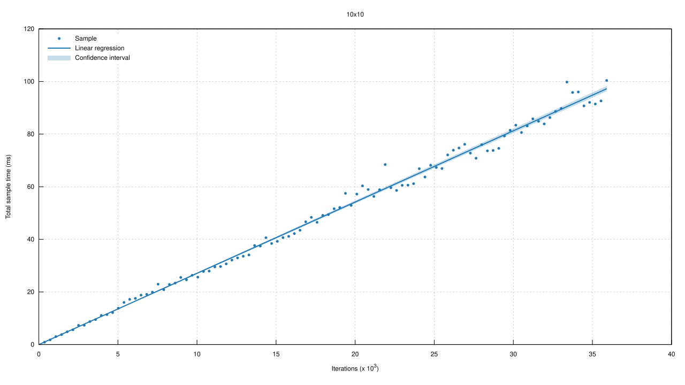

# Benchmarks — wingfoil

**Jump to [Results](#results)** for a captured run — charts, statistics, and
what they say.

Criterion benchmarks for the wingfoil engine. Two groups live here:

- **wingfoil-specific** — the tier/engine suites that have no legacy counterpart
  (`tiers`, `custom_op`, `store_baseline`);
- **ports of `legacy/wingfoil/benches/`** — one target per legacy target, with the
  same name, the same `required-features` gating and, wherever possible, the
  same workload, so a wingfoil reading can be put straight beside the legacy one.
  That comparability is the whole point of the ports, and it disappears at the
  Phase-7 cutover when the legacy bar goes away.

**Benches are not a CI gate and are not meant to become one.** Criterion
wall-clock thresholds are too noisy on shared runners, so nothing in
`.github/workflows/` runs `cargo bench`; this suite is a run-on-demand
scaffold. The deterministic perf gates are *tests* — see
`tests/sparse_graph.rs` and `tests/merge_n.rs`, and `docs/port-plan.md`
("The perf gate — a test, not a benchmark").

## Targets

| Target | Features needed | Legacy twin | What it measures |
|---|---|---|---|
| `tiers` | — | *(wingfoil-only)* | legacy / interpreted / compiled / nested, side by side, on eight workloads |
| `custom_op` | — | *(wingfoil-only)* | a user op through the generic fallback vs a built-in table row, both compiled |
| `store_baseline` | — | *(wingfoil-only)* | the pre-arena baseline: sparse-vs-full-sweep dispatch, and the payload-clone ceiling/floor |
| `graph` | `bench` | `graph` | graph overhead: one engine cycle through a `width` × `depth` DAG |
| `nanotime` | — | `nanotime` | cost of reading the graph clock |
| `bfs_vs_dfs_wingfoil` | — | `bfs_vs_dfs_wingfoil` | branch/recombine at depths 1–10 on the wingfoil engine, all three tiers: interpreted, whole-program compiled, compiled island |
| `bfs_vs_dfs_reactive` | — | `bfs_vs_dfs_reactive` | the same pattern in rxrust (per-path comparison baseline) |
| `bfs_vs_dfs_async_streams` | `async` | `bfs_vs_dfs_async_streams` | the same pattern in tokio async/await (per-path comparison baseline) |
| `iceoryx2` | `iceoryx2` | `iceoryx2` | `Burst<T>` push / iterate / clone |
| `iceoryx2_modes` | `iceoryx2` | `iceoryx2_modes` | the adapter's `Spin` / `Threaded` / `Signaled` subscriber modes |
| `aeron_publication_latency` | `aeron` | same | `offer` latency across message sizes |
| `aeron_subscription_throughput` | `aeron` | same | poll / poll-and-parse / burst throughput |
| `aeron_transceiver` | `aeron` | same | simultaneous pub+sub, request/response roundtrip, bidirectional exchange |
| `aeron_allocation_tracking` | `aeron` (+ `dhat-heap`) | same | allocations on the `offer` / `try_claim` / `poll` hot paths |

The `bench` feature exposes `wingfoil::bencher::add_bench`, the criterion
harness `graph` drives — the twin of legacy's `bench`-gated `bencher` module,
and off by default for the same reason (criterion stays out of a normal
dependency tree). `bfs_vs_dfs_wingfoil` used to need it too; it now drives its
graphs from an internal ticker instead, and needs no feature at all.

## Running

```bash
# wingfoil-only suites
cargo bench --manifest-path crates/wingfoil/Cargo.toml --bench tiers
cargo bench --manifest-path crates/wingfoil/Cargo.toml --bench custom_op
cargo bench --manifest-path crates/wingfoil/Cargo.toml --bench store_baseline

# graph overhead / clock
cargo bench --manifest-path crates/wingfoil/Cargo.toml --features bench --bench graph
cargo bench --manifest-path crates/wingfoil/Cargo.toml --bench nanotime

# topological sort vs per-path propagation (see topological_vs_per_path/README.md)
cargo bench --manifest-path crates/wingfoil/Cargo.toml --bench bfs_vs_dfs_wingfoil
cargo bench --manifest-path crates/wingfoil/Cargo.toml --bench bfs_vs_dfs_reactive
cargo bench --manifest-path crates/wingfoil/Cargo.toml --features async --bench bfs_vs_dfs_async_streams

# adapters
cargo bench --manifest-path crates/wingfoil/Cargo.toml --features iceoryx2 -- iceoryx2
cargo bench --manifest-path crates/wingfoil/Cargo.toml --features aeron-driver --bench aeron_publication_latency
cargo bench --manifest-path crates/wingfoil/Cargo.toml --features aeron-driver,dhat-heap --bench aeron_allocation_tracking
```

The aeron targets need a media driver: `--features aeron-driver` embeds one
in-process, or set `AERON_EXTERNAL_DRIVER=1` and run `aeronmd` yourself. With
only `--features aeron` (no driver) the benches print a skip message and exit
cleanly. They also need the Aeron C toolchain — clang, `uuid-dev`, CMake ≥ 3.20
(see the repo-root `CLAUDE.md`).

## What the ports changed, and what they did not

The rule for every port was: **keep the workload, change only what the engine
forces.** Each bench's own module doc records its deviations; in summary —

- `bfs_vs_dfs_reactive` and `bfs_vs_dfs_async_streams` benchmark *other
  libraries* (rxrust, tokio) as comparison baselines. They touch no wingfoil
  type at all, so they are verbatim copies.
- The four `aeron_*` benches and `iceoryx2` drive ported *backend* / value
  types (`RusteronPublisher`, `RusteronSubscriber`, `ClaimBuffer`, `Burst<T>`)
  rather than a graph, and those twins have identical signatures — so only the
  crate in the import path changes. `Burst<T>` and `NanoTime` are in fact the
  *same types* (wingfoil re-exports legacy's), so `iceoryx2` and `nanotime` measure
  identical code on both trees and must not diverge.
- `graph`, `bfs_vs_dfs_wingfoil` and `iceoryx2_modes` genuinely move onto the
  wingfoil engine. The rewiring is mechanical and node-count-preserving:
  `Rc<dyn Node>` factories become `GraphBuilder` + `Stream<T>`,
  `merge(vec)` becomes `merge_all` (one `MergeN` node either way),
  `add(&a, &b)` becomes `join` (one both-arms-active node either way),
  `produce(closure)` becomes `map(closure)`, and `map(f)` takes `&T` instead of
  `T`. Node counts match the legacy graphs exactly, so the numbers stay
  comparable.
- `bfs_vs_dfs_wingfoil` then goes one step further than a port: its depth sweep
  is defined in `nitro!` blocks, so each depth's wiring drives all three engines
  instead of one. It also changes how it is *timed*. Legacy measures one tick
  per sample through its `bencher`; next drives a self-contained graph from an
  internal ticker for a fixed 10 000 cycles and divides. That removes a
  cross-thread handshake worth several hundred nanoseconds against graphs
  costing tens — the old per-tick sweep was mostly harness — and it is also what
  makes the whole-program `compiled()` tier measurable at all, since `nitro!`
  only emits it for a graph with no stream parameters. The workload stays
  node-for-node identical to legacy's; the timing method does not, so the two
  trees' numbers are no longer directly comparable on this bench.

# Results

`cargo bench` writes criterion's HTML report to `target/criterion/`; the plots
below were lifted out of one such run by
[`../../../scripts/bench-report.sh`](../../../scripts/bench-report.sh), which
also prints the numbers in the tables. (The file format differs from legacy's
captured report: criterion 0.8 draws through the `plotters` backend and emits
**SVG**, where legacy's criterion 0.5 run used the gnuplot backend and emitted
PNG. Same plots, same statistics.)

**Everything below is a *reading*, not source.** Criterion wall-clock numbers
are hardware-specific, and this particular machine is a shared 4-core cloud VM
— noisier than legacy's reading in every respect (the `10x10` regression R²
below is 0.83, against 0.9999 on legacy's dedicated box). **Read the ratios,
not the absolute times**: every comparison here is between bars measured back
to back on the same machine in the same run, which is what the suite is for.

Measured on two machines, because two sections have been re-captured since the
original run. Each section below says which one it came from; **numbers only
compare within a machine.**

| | Machine A | Machine B |
|---|---|---|
| CPU | Intel Xeon @ 2.80 GHz, 4 cores (KVM guest) | Intel Xeon @ 2.10 GHz, 4 cores (KVM guest) |
| Cache | L1d 128 KiB · L2 4 MiB · L3 33 MiB | L1d 192 KiB · L2 8 MiB · L3 260 MiB |
| `lscpu` | [`images/lscpu.txt`](images/lscpu.txt) | [`images/lscpu-b.txt`](images/lscpu-b.txt) |
| Sections | graph overhead, the clock, user ops, store baseline | [execution tiers](#execution-tiers), [topological sort](#topological-sort-vs-per-path-propagation) |

Toolchain either way: stable rustc, `bench` profile (`opt-level=3`), run with
`cargo bench --manifest-path crates/wingfoil/Cargo.toml --features bench,async`. Legacy's reading, for
comparison, is in
[`legacy/wingfoil/benches/README.md`](../../../legacy/wingfoil/benches/README.md) — a
3.80 GHz Xeon, so its absolute numbers run faster than either.

**The machine-A sections predate the lazy wall-clock snap** (`Kernel::wall_time`
now resolves on first read in a cycle instead of being taken in `begin_cycle`).
That removes one `NanoTime::now()` — ~24 ns, see [the clock](#the-clock) — from
every cycle of every graph that never stamps latency, which is most of them, and
it bites hardest where the per-cycle cost is smallest. **`custom_op`'s two
compiled bars are the ones to distrust**: at ~60 ns per cycle they are the same
order as the read being removed. `legacy` is unaffected — it keeps its own eager
snap in `GraphState`, deliberately, since it is the regression control — and so
is [the clock](#the-clock), which times `NanoTime::now()` directly.

Those sections are left as captured rather than adjusted by hand; they need a
run on machine A. The two machine-B sections have been re-captured since the
change and do not carry this caveat.

**Every section here also predates the scheduler-cost fix** — dedup in
`TimeQueue::push` scoped to one instant instead of scanning the whole pending
set, dispatch seeding from `Kernel::due()` instead of walking every
callback-activated node, and `end_cycle` clearing only the flags it set (see
`docs/port-plan.md`, "The `O(timers)` seed term"). What it moves is any graph
holding **more than a handful of timers**, which in this suite means
[`sparse_dispatch`](#store-baseline) above all: each of its 256 cold branches
has its own ticker. Sections whose graphs have one or two timers — the tiers,
the topological sweep — are affected only by the `end_cycle` term and move
little. Paired figures are in the port-plan section above; the tables below are
the pre-fix capture and want a re-run.

## Graph overhead

The [`graph`](graph.rs) bench wires a trivial DAG `width` × `depth`, with every
node ticking on every engine cycle, and measures one full engine cycle through
it.

| Bench | Nodes | Per engine cycle | Per node cycle |
|---|---|---|---|
| `node` | 0 (harness only) | 677.09 ns | — |
| `10x10` | 100 maps | **2.7090 µs** | 27.1 ns |
| `100x100` | 10 000 maps | 627.47 µs | 62.7 ns |




The `node` row is the floor: it wires *no* graph at all, so it measures only
the criterion↔worker handshake the harness pays per sample (see
[`src/bencher.rs`](../src/bencher.rs)). Subtracting it puts the `10x10` graph
work at ~2.03 µs, i.e. ~20 ns per node cycle — so a 10-node graph would carry
roughly 200 ns of engine overhead per cycle. `100x100` costs ~2.3× more per
node than `10x10`: at 10 000 nodes the per-cycle working set no longer fits the
way a 100-node one does.

### Additional statistics — `10x10`

| Metric | Lower bound | Estimate | Upper bound |
|--------|------------|----------|------------|
| Slope  | 2.6820 µs  | 2.7090 µs | 2.7380 µs |
| R²     | 0.8245365  | 0.8328463 | 0.8232724 |
| Mean   | 2.6872 µs  | 2.7107 µs | 2.7352 µs |
| Std. Dev. | 102.00 ns | 122.94 ns | 141.79 ns |
| Median | 2.6453 µs  | 2.6828 µs | 2.7167 µs |
| MAD    | 83.996 ns  | 118.17 ns | 143.89 ns |

### Additional plots

- [Typical](images/graph/10x10_typical.svg)
- [Mean](images/graph/10x10_mean.svg)
- [Std. Dev.](images/graph/10x10_SD.svg)
- [Median](images/graph/10x10_median.svg)
- [MAD](images/graph/10x10_MAD.svg)
- [Slope](images/graph/10x10_slope.svg)
- [`node`](images/graph/node_pdf.svg) · [`100x100`](images/graph/100x100_pdf.svg)

### Understanding this report

The first plot displays the average time per iteration for this benchmark. The
shaded region shows the estimated probability of an iteration taking a certain
amount of time, while the line shows the mean.

The second plot shows the linear regression calculated from the measurements.
Each point represents a sample, though here it shows the total time for the
sample rather than time per iteration. The line is the line of best fit for
these measurements.

See the [Criterion.rs documentation](https://bheisler.github.io/criterion.rs/book/user_guide/command_line_output.html#additional-statistics)
for more detail on the additional statistics.

## The clock

[`nanotime`](nanotime.rs) — one `NanoTime::now()`: **24.340 ns**
([plot](images/graph/nanotime_pdf.svg)). `NanoTime` is a *shared* type (next
re-exports legacy's), so this bench measures identical code on both trees and
the two readings must not diverge.

## Execution tiers

[`tiers`](tiers.rs) runs each workload on four engines — the legacy
`MutableNode` engine as the regression baseline, and wingfoil's three
`nitro!`-derived tiers. Absolute times are for the whole fixed-cycle run
(10 000 cycles, 20 000 for `accumulate`).


| Workload | Nodes | legacy | interpreted | compiled | nested | interp/legacy | interp/nested |
|---|---|---|---|---|---|---|---|
| `dense_chain` | 37 | 7.9491 ms | 6.6387 ms | 187.08 µs | 930.81 µs | **0.84×** | 7.1× |
| `fanout` | 103 | 17.052 ms | 11.993 ms | 324.26 µs | 1.4309 ms | **0.70×** | 8.4× |
| `fan_in_16` | 20 | 4.7610 ms | 2.6683 ms | 174.44 µs | 854.77 µs | **0.56×** | 3.1× |
| `fan_in_64` | 68 | 10.722 ms | 6.4710 ms | 258.57 µs | 938.48 µs | **0.60×** | 6.9× |
| `fan_in_256` | 260 | 38.079 ms | 31.599 ms | 2.5496 ms | 3.0954 ms | **0.83×** | 10.2× |
| `accumulate` | 3 | 2.0837 ms | 1.4268 ms | 326.31 µs | 1.4033 ms | **0.68×** | 1.0× |
| `sparse` | 205 | 2.5036 ms | 2.1139 ms | 310.63 µs | 751.34 µs | **0.84×** | 2.8× |
| `sparse_wide` | 781 | 3.0716 ms | 2.0145 ms | 355.15 µs | 895.66 µs | **0.66×** | 2.2× |

Four things to read off it:

- **The Phase-6 gate holds on all eight workloads.** wingfoil-interpreted is
  0.56×–0.84× of legacy — at least as fast, as the plan requires, and by a
  wider margin than the previous capture (0.66×–1.00×).
- **Compiled wins everywhere**, from 4.4× faster than interpreted
  (`accumulate`, where the scheduler loop rather than dispatch dominates) up to
  37× (`fanout`, dense dispatch — its home ground).
- **So does nested**, by 2.2×–10.2× — except on `accumulate`, where at 1.0× it
  is now a wash. A three-node graph gives an island almost nothing to amortise
  its boundary against.
- **`fan_in_*` is no longer flat with width** — 0.56× / 0.60× / 0.83× at 16 /
  64 / 256, where the previous capture read 0.66× / 0.68× / 0.69×. Flatness is
  the actual check here, because the n-ary-merge regression this sweep was
  built to catch showed up as a ratio that *grew* with width. **Do not read
  this as that regression returning**: wingfoil-interpreted's own `fan_in_256` bar
  barely moved between captures (−0.6%), while *legacy's* fell 17.9% — the
  largest single move in the control column below. The ratio rose because the
  denominator moved. It is still worth a confirming re-run.

### What moved since the previous capture, and why

This capture is **not** a controlled before/after against the one it replaces:
"machine B" names a *spec*, and this is a different VM instance of it (same
model, caches and BogoMIPS as
[`images/lscpu-b.txt`](images/lscpu-b.txt), different host neighbours). The
`legacy` column is the useful control — no code in this repo changed under it —
so its movement measures instance-to-instance variation directly:

| Tier | Movement vs the previous capture | Code changed? |
|---|---|---|
| `legacy` | +3.7% … −17.9% | no — the control |
| `nested` | −7.5% … −30.8% | no (islands share one snap per activation either way) |
| `interpreted` | −0.6% … −31.1% | one clock read per cycle removed |
| `compiled` | −14.4% … −69.8% | one clock read per cycle removed |

Only **compiled** moves clearly outside the control's band, on seven of the
eight workloads — which is what you would expect from making the per-cycle wall
snap lazy: a ~24 ns clock read came off a bar that was running at ~55 ns per
cycle. The interpreted and nested columns overlap the control band, so their
movement is not attributable here, and this page does not attribute it.

An earlier capture had `nested` trailing `interpreted` on all eight workloads
(1.12×–1.43×), contradicting the bench's own module docs. That was a defect
rather than hardware: `Ctx::nested` snapped a fresh `NanoTime::now()` every
time it was built, i.e. **once per inner node per activation**, putting a ~24 ns
TSC read (see [the clock](#the-clock), which prices exactly that call) on every
node of every island. Islands now take the outer cycle's wall snap, which is
both faster and more correct — an island's ops agree with the rest of the graph
on what "this cycle" means instead of each reading its own instant.

Per-workload violin plots:
[`dense_chain`](images/tiers/dense_chain.svg) ·
[`fanout`](images/tiers/fanout.svg) ·
[`fan_in_16`](images/tiers/fan_in_16.svg) ·
[`fan_in_64`](images/tiers/fan_in_64.svg) ·
[`fan_in_256`](images/tiers/fan_in_256.svg) ·
[`accumulate`](images/tiers/accumulate.svg) ·
[`sparse`](images/tiers/sparse.svg) ·
[`sparse_wide`](images/tiers/sparse_wide.svg)

## User ops vs the built-in table

[`custom_op`](custom_op.rs) — a 20-stage chain of a *user* op driven through
the generic compiled fallback, against the same chain built from a built-in
table row. 23 nodes × 10 000 cycles.

| Bench | Time | Throughput |
|---|---|---|
| `table_map_n_compiled` | 607.80 µs | 378.41 Melem/s |
| `custom_fallback_compiled` | 622.49 µs | 369.48 Melem/s |
| `custom_interpreted` | 5.5953 ms | 41.106 Melem/s |

A user op costs **2.4% more** than a built-in on the compiled path — the
generic fallback is not a second-class citizen, which is the property
`#[op(build = …)]` exists to guarantee. Both compiled paths are ~9× the
interpreted one. [Violin plot](images/ops/custom_op_dense_chain_20.svg).

## Store baseline

[`store_baseline`](store_baseline.rs) — the two measurements the arena / SoA
value-store decision hangs on.

**Sparse dispatch** (an ~8-node hot path in a graph padded to ~1030 nodes,
20 000 cycles): the dirty-list scheduler must track *active* nodes, not graph
size.

| Dispatch | Time | Per cycle |
|---|---|---|
| `Sparse` (default) | 19.676 ms | 984 ns |
| `FullSweep` (the `O(N)` oracle) | 121.08 ms | 6.05 µs |

**6.2× apart** — the dirty list is doing its job.

Both bars predate the scheduler-cost fix ([above](#results)), and this is the
bench it moves most: the padding is 256 cold branches with **256 separate
tickers**, so the `Sparse` bar was mostly paying for timers that never fired
rather than for the ~8 nodes that did. A paired re-run on the same machine puts
it at **19.4 ms → 5.88 ms**, i.e. ~294 ns per cycle rather than ~984, which
widens the sparse-vs-oracle gap from 6.2× to ~19×. The table above is left as
captured, matching how the other superseded readings here are handled.
[Violin plot](images/ops/store_sparse_dispatch.svg).

**Payload clone tax** (a large payload forwarded through a chain of `filter`
hops, each republishing its input by clone):

| Payload | Time | Throughput |
|---|---|---|
| `Vec<u64>` (8 KiB deep copy per hop) | 22.346 ms | 3.5801 Melem/s |
| `Rc<Vec<u64>>` (refcount bump per hop) | 5.1688 ms | 15.478 Melem/s |
| `f64` (scalar floor) | 3.1081 ms | 25.739 Melem/s |

The `Vec` − `Rc<Vec>` gap is what slot-aliasing could recover: **4.3×**, or
17.2 ms of the 22.3 ms run. That is the ceiling on the zero-copy passthrough
work, and it is large. [Violin plot](images/ops/store_forward_clone.svg).

## Topological sort vs per-path propagation

[`topological_vs_per_path/`](topological_vs_per_path/) — the branch/recombine
pattern at depths 1–10, where each level doubles the number of source→sink
paths.


Linear axis, which is what makes the doubling read as doubling — and which pins
all three wingfoil series to the floor and compresses the first four depths to
nothing. The same data on a log axis, where the low end and the crossovers are
legible:


wingfoil stays flat across ten levels — every node visited once per tick —
while both path-at-a-time libraries double per level (2.01× and 1.94× measured).
At depth 10 the interpreted engine (287.5 ns) is **~79× faster than rxrust**
(22.595 µs) and **~134× faster than tokio async** (38.487 µs); compiled is
**945×** and **1610×**. At depth 20 the same slopes put the gap in the millions.

Two caveats on those multipliers, both of which cut *against* wingfoil:

- **The rxrust iteration is two source emissions** (`root.next` twice — the
  second is what produces the doubling), where tokio's `block_on` is one. Per
  source event the rxrust ratio is therefore about half the figure above, ~39×
  rather than 79×. The slopes, which are the actual claim, are unaffected.
- **The units differ.** The wingfoil series are per *cycle* — a self-contained
  graph run for a fixed 10 000 cycles, nothing else under the measurement —
  while rxrust and tokio are per *source event*, called directly on the
  criterion thread. Neither side pays a bench handshake, which is what makes the
  comparison as close as it gets, but read the slopes rather than the ratios.

Removing that handshake is what turns the flat line into the actual scaling law:
**≈ 68 ns + 22.0 ns × depth** interpreted, one more node per level, while the
path count runs to 1024. Being self-contained is also what lets the sweep carry
**all three** tiers: `compiled()` is only emitted for a graph with no stream
parameters, so a graph fed from a bench harness can never have it.
The whole-program tier costs **~22 ns for the entire graph at every depth**
(21.1 ns at depth 1, 23.9 at depth 10 — 0.35 ns per level), about what the
interpreter pays for a single node. The island is flat too (73.8 → 86.0 ns,
0.67 ns per level); the ~55 ns between the two compiled lines is the island's
boundary — one outer dyn call, a private `TimeQueue`, a mini `begin_cycle` per
activation — which 4–13 nodes give it nothing to amortise against. The
interpreted slope is unchanged across three captures (22 ns/level); only its
fixed term wanders. (The adds themselves are not optimized away: every level's
sum passes through `black_box`, precisely so the compiled tiers cannot collapse
the chain — see [`wingfoil.rs`](topological_vs_per_path/wingfoil.rs)'s module
doc.)


This section was measured on machine B (see [above](#results)); everything
above it is machine A, and the two do not compare.
Full numbers and commentary:
[`topological_vs_per_path/README.md`](topological_vs_per_path/README.md).

## Not covered here

This run covered the targets that build under `--features bench,async`. The
`iceoryx2*` and `aeron_*` ones sit behind transport features that were not
enabled here — aeron additionally needs the Aeron C toolchain and a media
driver — so no reading is captured for them. Their commands are in
[Running](#running) above.

## Regenerating

```bash
scripts/bench-report.sh          # run the suite, refresh images/, print the tables
```

The script runs every target that needs no external service, copies criterion's
plots into [`images/`](images/), and prints each benchmark's estimate so the
tables above can be refilled. The hand-drawn charts are rebuilt from data pasted
into their scripts: [`plot_tiers.py`](plot_tiers.py) (tier summary) and
[`topological_vs_per_path/plot.py`](topological_vs_per_path/plot.py), which
renders three for topological sort vs per-path propagation: `cross_library.png`
on a linear axis and `cross_library_log.png` on a log one (same data, drawn
twice — linear for the shape, log to read the low end), plus `per_cycle.png`.

# Where wingfoil sits — performance positioning

A self-contained reading of what the numbers in this report add up to: which
latency class the engine serves today, what the payload-cost model is, and
where the boundary of credible claims lies. Anchors are the captured runs
above — re-derive them from [Results](#results), not from this prose, if they
have been re-captured since.

## The engine core, in system terms

- **A compiled-tier cycle is tens of nanoseconds.** `dense_chain` (37 nodes)
  completes 10,000 cycles in 187µs — ~19ns per cycle for the whole graph
  ([execution tiers](#execution-tiers)). Engine overhead is not where a
  wingfoil system spends its budget.
- **Reading the clock costs 24ns** ([the clock](#the-clock)), and a cycle in
  which no op stamps reads it zero times (the lazy wall snap).
- **The engine core allocates nothing per cycle.** Slots, dirty flags and
  contexts are preallocated or stack-built. The exception is the scheduler's
  look-ahead map: `delay` with many values in flight inserts into a
  `BTreeMap`, whose nodes are heap allocations — disclosed here because a
  zero-malloc audit has to name it; plain ticker/source graphs never touch it.
- **A shared-memory hop (iceoryx2 `Spin`) is ~1–5µs** process to process —
  the multi-process latency demos in `examples/latency/` measure it live.

## The payload cost model

Values move between nodes **by reference** in every tier — slot borrows
interpreted, locals compiled — so transporting a large struct through a chain
of transforms costs one construction at the producer and nothing per hop.
The real costs sit at the edges, and each has a mechanism aimed at it:

| cost | where it bites | mechanism |
|---|---|---|
| per-message construction + drop of heap-owning payloads | channel producers (sockets, decoders) | `pooled_channel` — loaned, recycled buffers; zero payload allocations at steady state (`pool` module) |
| routing ops clone to re-emit (`filter`/`merge`/`sample`/`delay` own their slot) | any pass-through hop | `Pooled<T>` / `Rc<T>` handles — the clone becomes a refcount bump |
| ingress copy | any byte-stream transport | irreducible floor of **one** copy (recv + decode, fusable); only shared memory gets to zero |

The steady-state floor per input message, by ingress:

| ingress | allocs | copies |
|---|---|---|
| iceoryx2 (shared memory) | 0 | 0 — the producer's write *is* the delivery |
| socket / file → pooled decode | 0 | 1 (kernel→user + the decode pass) |
| naive owned path, for contrast | 2–6 | 2–4 |

The claim above the table is enforced, not aspirational: the
`steady_state_allocs` test (added by the pooled-channel benchmark PR) wraps a
counting `#[global_allocator]` around the pooled order-book pipeline and
asserts zero payload-sized allocations across a thousand-message run (small
documented residuals — the handle's control block and the transport node —
carry a pinned per-message budget). `pooled_channel_bench` (added by the same
PR) puts the same pipeline beside the naive owned path and the `Arc<T>`
pattern a good user writes today; `Arc` is the honest baseline, since it
already collapses the routing clones with no engine support.

## Which latency class this serves

- **Today: mid-tier latency systems** — tens-of-microseconds budgets and up:
  crypto trading (venue jitter is milliseconds), market-making and signals
  off commodity co-lo, real-time telemetry/AI pipelines. The differentiator
  is not raw speed but that the *same graph* backtests deterministically,
  runs live, and stamps its own latency (`latency` module).
- **Competitive software HFT (single-digit-µs tick-to-trade)**: the engine
  core is credible — no locks on the cycle path, no dyn dispatch compiled, no
  GC, busy-spin sources, allocation-free steady state — but the surrounding
  kit is not there yet: ingress is TCP/websocket-class (no kernel-bypass
  adapter), and deployment discipline (pinning, NUMA, huge pages, warm-up) is
  the operator's problem. Those are adapter- and ops-shaped gaps, not engine
  rewrites; a bypass NIC DMA-ing into pooled buffers is the same loan pattern
  `pooled_channel` already defines.
- **Sub-microsecond wire-to-wire**: that race is won in FPGAs, and no
  software framework competes. The long-run answer is not a faster software
  engine but lowering the *same* op graph to hardware — explored in
  [`docs/fpga-hdl-backend-decision.md`](../../../docs/fpga-hdl-backend-decision.md).

What is deliberately **not** claimed: these captures come from shared dev
VMs, not tuned metal (treat them as shape, not spec); Criterion means hide
tail behaviour (the allocation gate exists precisely because p99.9 allocator
stalls do not show in a mean); and no wire-to-trade number exists yet — that
requires the bypass ingress work above.
