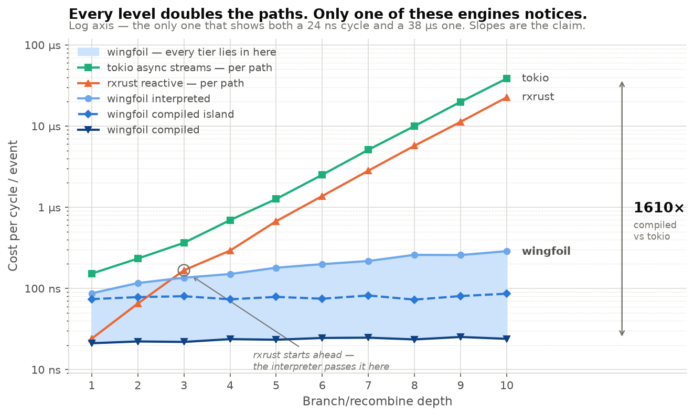
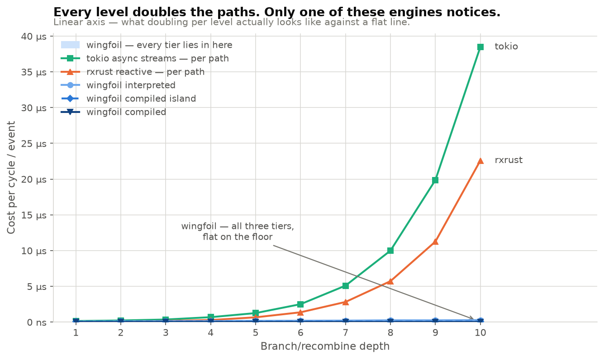
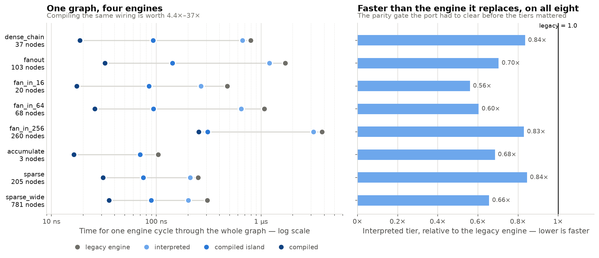
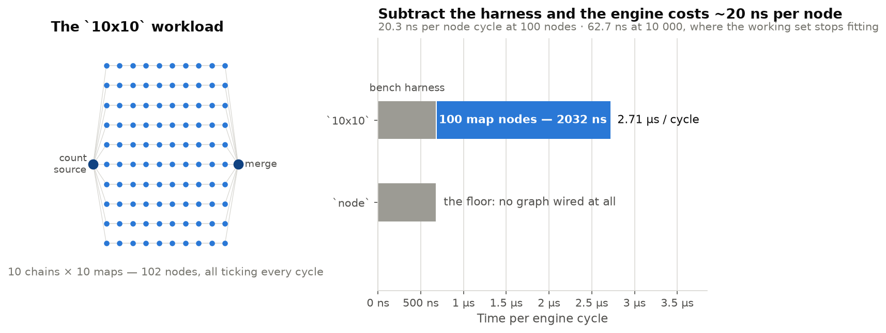
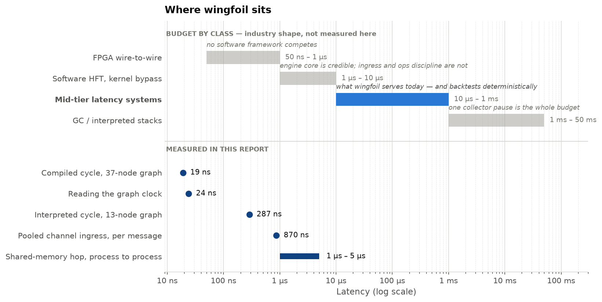

# Wingfoil, measured

Wingfoil visits every node once per tick, in topological order, and can compile
the whole graph into one function. This page is what that buys, measured — and
what it does not buy, stated as plainly.

| | Measured here |
|---|---|
| Branch/recombine at depth 10, against tokio async streams | **1610×** compiled, 134× interpreted — and the gap grows with depth |
| Compiling the same wiring, across eight workloads | **4.4×–37×** faster than the interpreted tier |
| Engine overhead per node cycle | **~20 ns**, with every node ticking every cycle |
| Reading the graph clock | **24 ns** — and a cycle in which nothing stamps latency never pays it |
| Channel ingress with pooled payloads | **0.87 µs** per message, zero payload allocations at steady state |

**Read the ratios, not the absolute times.** Everything below was captured on
shared 4-core cloud VMs, and every comparison is between bars measured back to
back in the same run — that is what the suite is for. Full method, machines and
caveats: [how these were measured](#how-these-were-measured).

Jump to: [the headline](#flat-where-reactive-doubles) ·
[method](#how-these-were-measured) · [the tiers](#three-engines-one-wiring) ·
[cycle cost](#what-a-cycle-costs) · [positioning](#where-wingfoil-sits) ·
[every target](#the-catalog)

# Flat where reactive doubles

The branch/recombine graph is the shape that separates execution models. At
depth N there are 2^N distinct paths from source to sink, and the question is
whether an engine pays for paths or for nodes.



Both per-path libraries double every level — 2.01× and 1.94× measured across the
sweep. All three wingfoil tiers stay flat, because the graph is sorted so that
every node is scheduled after everything it reads, and the scheduler visits each
node exactly once per tick however many upstream paths lead to it.

The same data on a linear axis, which is where the doubling reads as doubling
and every wingfoil tier collapses onto the floor:



| Depth 10 | Per cycle / event | vs wingfoil compiled |
|---|---|---|
| wingfoil compiled | **23.9 ns** | 1× |
| wingfoil compiled island | 86.0 ns | 3.6× |
| wingfoil interpreted | 287.5 ns | 12.0× |
| rxrust | 22.595 µs | **945×** |
| tokio async streams | 38.487 µs | **1610×** |

Least squares over the ten depths turns the flat line into a scaling law:
**≈ 68 ns + 22.0 ns × depth** interpreted — one more level is one more node and a
fixed ~22 ns — while the path count runs 2 → 1024. The whole-program tier is
**≈ 21 ns + 0.35 ns × depth** for the *entire graph*, about what the interpreter
pays for a single node; the island is flat too (**≈ 74 ns + 0.67 ns × depth**),
the ~55 ns between the two compiled lines being the island's boundary — one outer
dyn call, a private `TimeQueue`, a mini `begin_cycle` per activation — which
4–13 nodes give it nothing to amortise against. Across three captures the
interpreted *slope* has not moved; only its fixed term wanders with the machine.

Two readings of the same chart, answering different questions. At depth 1 there
is no branching to exploit and the gap is the *runtime* difference: 21.1 ns
compiled against tokio's 152 ns, ~7×. At depth 10 the gap is the *algorithmic*
difference on a workload built to expose it, and it is unbounded in depth —
extending the same slopes to depth 20 puts it in the millions. Quote whichever
matches the claim being made.

Three caveats, all of which cut *against* wingfoil, and none of which touch the
slopes:

- **The units differ.** The wingfoil series are per *cycle*, from a
  self-contained graph run for a fixed 10 000 cycles with nothing else under the
  measurement; rxrust and tokio are per *source event*, called straight into the
  library on the criterion thread. Neither side pays a bench handshake, which is
  as close to like-for-like as these three targets get, but a cycle and an event
  are not the same unit.
- **The rxrust column is two source emissions per sample**, not one — the second
  is what makes each level double. Per source event its ratios are about half
  what the table implies (~39× against the interpreter at depth 10, not 78.6×).
  Left as the legacy target wrote it so the two readings stay comparable.
- **`async_streams.rs` is barely a tokio measurement.** It is recursive
  `Box::pin(async move …)` over an immediately-ready leaf, so nothing yields and
  the scheduler is uninvolved past `block_on`; what doubles is 2^(N+1)−1 heap
  allocations plus poll dispatch. It is an honest depiction of *per-path
  propagation* — which is what the comparison is about — and not a claim about
  the best an async implementation could do on this DAG.

The added work is genuinely executed, too: every level's sum passes through
`black_box`, put there specifically so the compiled tiers cannot notice that
summing one value 2^N times is a shift and collapse the chain. What compilation
removes is the *dispatch* around the add, not the add.

Full per-depth numbers, the crossovers, and the three tiers drawn as separate
lines: [`topological_vs_per_path/README.md`](topological_vs_per_path/README.md).
The mechanism in 40 lines of runnable code:
[`core/topological_sort`](../examples/core/topological_sort/).

# How these were measured

Criterion, run on demand. **Benches are not a CI gate and are not meant to become
one** — wall-clock thresholds are too noisy on shared runners, so nothing in
`.github/workflows/` runs `cargo bench`. The deterministic perf gates are
*tests*: `tests/sparse_graph.rs` and `tests/merge_n.rs` (see `docs/planning/port-plan.md`,
"The perf gate — a test, not a benchmark"), and `tests/steady_state_allocs.rs`,
which wraps a counting `#[global_allocator]` around the pooled ingress pipeline
and asserts allocation *counts* — exact where wall-clock is noisy.

**Everything below is a *reading*, not source.** Criterion wall-clock numbers are
hardware-specific, and these machines are shared cloud VMs: the `10x10`
regression R² is 0.83 here, against 0.9999 on legacy's dedicated box. Two
machines are in play, because some sections have been re-captured since the
original run — each section says which, and **numbers only compare within a
machine.**

| | Machine A | Machine B |
|---|---|---|
| CPU | Intel Xeon @ 2.80 GHz, 4 cores (KVM guest) | Intel Xeon @ 2.10 GHz, 4 cores (KVM guest) |
| Cache | L1d 128 KiB · L2 4 MiB · L3 33 MiB | L1d 192 KiB · L2 8 MiB · L3 260 MiB |
| `lscpu` | [`images/lscpu.txt`](images/lscpu.txt) | [`images/lscpu-b.txt`](images/lscpu-b.txt) |
| Sections | [what a cycle costs](#what-a-cycle-costs) — graph overhead, the clock, user ops, store baseline | [the headline](#flat-where-reactive-doubles), [the tiers](#three-engines-one-wiring) |

Toolchain either way: stable rustc, `bench` profile (`opt-level=3`), run with
`cargo bench --manifest-path crates/wingfoil/Cargo.toml --features bench,async`.

Legacy's reading of the `graph.rs` 10×10 workload, on a 3.80 GHz CPU, is
**~2 µs per engine cycle — 20 ns per node cycle** (slope 1.9912 µs, median
1.9911 µs, MAD 1.29 ns, R² 0.99993). Its absolute numbers run faster than
either machine here, so compare the per-node figure, not the wall clock. That
reading is inlined rather than linked because it was legacy's own
`benches/README.md`, which dies with the tree; the legacy-vs-wingfoil tier
comparison that cannot be re-run once the tree is gone is banked in
[`docs/planning/cutover-plan.md`](../../../docs/planning/cutover-plan.md)
under gate 6.4.

The charts share one colour language so meaning carries between them: blue is
wingfoil and which blue says which tier, orange is rxrust, aqua is tokio, grey is
anything that is not engine work. See [`palette.py`](palette.py).

<details>
<summary><b>Two engine changes landed after some of these captures</b> — which sections they touch, and by how much</summary>

**The lazy wall-clock snap.** `Kernel::wall_time` now resolves on first read in a
cycle instead of being taken in `begin_cycle`, which removes one
`NanoTime::now()` — ~24 ns, see [the clock](#the-clock) — from every cycle of
every graph that never stamps latency, which is most of them. It bites hardest
where the per-cycle cost is smallest. **The machine-A sections predate it**, and
`custom_op`'s two compiled bars are the ones to distrust: at ~60 ns per cycle they
are the same order as the read being removed. `legacy` is unaffected — it keeps
its own eager snap in `GraphState`, deliberately, since it is the regression
control — and so is [the clock](#the-clock), which times `NanoTime::now()`
directly. The machine-B sections were re-captured after the change.

**The scheduler-cost fix.** Dedup in `TimeQueue::push` scoped to one instant
instead of scanning the whole pending set, dispatch seeding from `Kernel::due()`
instead of walking every callback-activated node, and `end_cycle` clearing only
the flags it set (see `docs/planning/port-plan.md`, "The `O(timers)` seed term"). **Every
section here predates it.** What it moves is any graph holding more than a
handful of timers, which in this suite means
[`sparse_dispatch`](#the-dirty-list-and-the-clone-tax) above all — each of its
256 cold branches has its own ticker. Sections whose graphs have one or two
timers (the tiers, the depth sweep) are affected only by the `end_cycle` term and
move little. The paired figure for `sparse_dispatch` is quoted where it appears;
the tables are left as captured rather than adjusted by hand.

</details>

# Three engines, one wiring

The same `nitro!` block drives four engines: the legacy `MutableNode` engine as
the regression control, and wingfoil's three tiers — interpreted, a compiled
island nested inside an interpreted graph, and the whole program compiled into a
single function. [`tiers`](tiers.rs) runs all four over eight workloads.



Absolute times are for the whole fixed-cycle run (10 000 cycles, 20 000 for
`accumulate`):

| Workload | Nodes | legacy | interpreted | compiled | nested | interp/legacy | interp/nested |
|---|---|---|---|---|---|---|---|
| `dense_chain` | 37 | 7.9491 ms | 6.6387 ms | 187.08 µs | 930.81 µs | **0.84×** | 7.1× |
| `fanout` | 103 | 17.052 ms | 11.993 ms | 324.26 µs | 1.4309 ms | **0.70×** | 8.4× |
| `fan_in_16` | 20 | 4.7610 ms | 2.6683 ms | 174.44 µs | 854.77 µs | **0.56×** | 3.1× |
| `fan_in_64` | 68 | 10.722 ms | 6.4710 ms | 258.57 µs | 938.48 µs | **0.60×** | 6.9× |
| `fan_in_256` | 260 | 38.079 ms | 31.599 ms | 2.5496 ms | 3.0954 ms | **0.83×** | 10.2× |
| `accumulate` | 3 | 2.0837 ms | 1.4268 ms | 326.31 µs | 1.4033 ms | **0.68×** | 1.0× |
| `sparse` | 205 | 2.5036 ms | 2.1139 ms | 310.63 µs | 751.34 µs | **0.84×** | 2.8× |
| `sparse_wide` | 781 | 3.0716 ms | 2.0145 ms | 355.15 µs | 895.66 µs | **0.66×** | 2.2× |

Four things to read off it:

- **The port is faster than the engine it replaces, on all eight.**
  wingfoil-interpreted is 0.56×–0.84× of legacy — the Phase-6 gate, cleared by a
  wider margin than the previous capture (0.66×–1.00×).
- **Compiled wins everywhere**, from 4.4× faster than interpreted (`accumulate`,
  where the scheduler loop rather than dispatch dominates) up to 37× (`fanout`,
  dense dispatch — its home ground).
- **So does nested**, by 2.2×–10.2× — except on `accumulate`, where at 1.0× it is
  a wash. A three-node graph gives an island almost nothing to amortise its
  boundary against.
- **`fan_in_*` is no longer flat with width** — 0.56× / 0.60× / 0.83× at 16 / 64 /
  256, where the previous capture read 0.66× / 0.68× / 0.69×. Flatness is the
  actual check here, because the n-ary-merge regression this sweep was built to
  catch showed up as a ratio that *grew* with width. **Do not read this as that
  regression returning**: wingfoil-interpreted's own `fan_in_256` bar barely moved
  between captures (−0.6%), while *legacy's* fell 17.9%. The ratio rose because
  the denominator moved. It is still worth a confirming re-run.

Per-workload violin plots:
[`dense_chain`](images/tiers/dense_chain.svg) ·
[`fanout`](images/tiers/fanout.svg) ·
[`fan_in_16`](images/tiers/fan_in_16.svg) ·
[`fan_in_64`](images/tiers/fan_in_64.svg) ·
[`fan_in_256`](images/tiers/fan_in_256.svg) ·
[`accumulate`](images/tiers/accumulate.svg) ·
[`sparse`](images/tiers/sparse.svg) ·
[`sparse_wide`](images/tiers/sparse_wide.svg)

<details>
<summary><b>What moved since the previous capture, and why</b></summary>

This capture is **not** a controlled before/after against the one it replaces:
"machine B" names a *spec*, and this is a different VM instance of it (same
model, caches and BogoMIPS as [`images/lscpu-b.txt`](images/lscpu-b.txt),
different host neighbours). The `legacy` column is the useful control — no code
in this repo changed under it — so its movement measures instance-to-instance
variation directly:

| Tier | Movement vs the previous capture | Code changed? |
|---|---|---|
| `legacy` | +3.7% … −17.9% | no — the control |
| `nested` | −7.5% … −30.8% | no (islands share one snap per activation either way) |
| `interpreted` | −0.6% … −31.1% | one clock read per cycle removed |
| `compiled` | −14.4% … −69.8% | one clock read per cycle removed |

Only **compiled** moves clearly outside the control's band, on seven of the eight
workloads — which is what you would expect from making the per-cycle wall snap
lazy: a ~24 ns clock read came off a bar that was running at ~55 ns per cycle.
The interpreted and nested columns overlap the control band, so their movement is
not attributable here, and this page does not attribute it.

An earlier capture had `nested` trailing `interpreted` on all eight workloads
(1.12×–1.43×), contradicting the bench's own module docs. That was a defect
rather than hardware: `Ctx::nested` snapped a fresh `NanoTime::now()` every time
it was built, i.e. **once per inner node per activation**, putting a ~24 ns TSC
read on every node of every island. Islands now take the outer cycle's wall snap,
which is both faster and more correct — an island's ops agree with the rest of
the graph on what "this cycle" means instead of each reading its own instant.

</details>

## A user's op is not a second-class citizen

[`custom_op`](custom_op.rs) — a 20-stage chain of a *user* op driven through the
generic compiled fallback, against the same chain built from a built-in table
row. 23 nodes × 10 000 cycles.

| Bench | Time | Throughput |
|---|---|---|
| `table_map_n_compiled` | 607.80 µs | 378.41 Melem/s |
| `custom_fallback_compiled` | 622.49 µs | 369.48 Melem/s |
| `custom_interpreted` | 5.5953 ms | 41.106 Melem/s |

A user op costs **2.4% more** than a built-in on the compiled path — the property
`#[op(build = …)]` exists to guarantee. Both compiled paths are ~9× the
interpreted one. [Violin plot](images/ops/custom_op_dense_chain_20.svg).

# What a cycle costs

[`graph`](graph.rs) wires the shape the engine is cheapest to reason about: one
source fanned into `width` chains of `depth` identity maps, recombined by a
single n-ary merge, with **every node ticking on every engine cycle**.



| Bench | Nodes | Per engine cycle | Per node cycle |
|---|---|---|---|
| `node` | 0 (harness only) | 677.09 ns | — |
| `10x10` | 100 maps | **2.7090 µs** | 27.1 ns |
| `100x100` | 10 000 maps | 627.47 µs | 62.7 ns |

The `node` row is the floor: it wires *no* graph at all, so it measures only the
criterion↔worker handshake the harness pays per sample (see
[`src/bencher.rs`](../src/bencher.rs)). Subtracting it puts the `10x10` graph work
at ~2.03 µs, i.e. **~20 ns per node cycle** — so a 10-node graph would carry
roughly 200 ns of engine overhead per cycle. `100x100` costs ~2.3× more per node
than `10x10`: at 10 000 nodes the per-cycle working set no longer fits the way a
100-node one does.

### The clock

[`nanotime`](nanotime.rs) — one `NanoTime::now()`: **24.340 ns**
([plot](images/graph/nanotime_pdf.svg)). The kernel snaps it lazily, on first read
in a cycle, so a cycle in which no op stamps latency reads the clock zero times.
`NanoTime` is a *shared* type (wingfoil re-exports legacy's), so this bench
measures identical code on both trees and the two readings must not diverge.

## The dirty list, and the clone tax

[`store_baseline`](store_baseline.rs) — the two measurements the arena / SoA
value-store decision hangs on.

**Sparse dispatch** (an ~8-node hot path in a graph padded to ~1030 nodes,
20 000 cycles): the dirty-list scheduler must track *active* nodes, not graph
size.

| Dispatch | Time | Per cycle |
|---|---|---|
| `Sparse` (default) | 19.676 ms | 984 ns |
| `FullSweep` (the `O(N)` oracle) | 121.08 ms | 6.05 µs |

**6.2× apart** — the dirty list is doing its job. Both bars predate the
scheduler-cost fix ([above](#how-these-were-measured)), and this is the bench it
moves most: the padding is 256 cold branches with **256 separate tickers**, so the
`Sparse` bar was mostly paying for timers that never fired rather than for the ~8
nodes that did. A paired re-run on the same machine puts it at
**19.4 ms → 5.88 ms**, i.e. ~294 ns per cycle rather than ~984, which widens the
sparse-vs-oracle gap from 6.2× to ~19×. The table above is left as captured.
[Violin plot](images/ops/store_sparse_dispatch.svg).

**Payload clone tax** (a large payload forwarded through a chain of `filter` hops,
each republishing its input by clone):

| Payload | Time | Throughput |
|---|---|---|
| `Vec<u64>` (8 KiB deep copy per hop) | 22.346 ms | 3.5801 Melem/s |
| `Rc<Vec<u64>>` (refcount bump per hop) | 5.1688 ms | 15.478 Melem/s |
| `f64` (scalar floor) | 3.1081 ms | 25.739 Melem/s |

The `Vec` − `Rc<Vec>` gap is what slot-aliasing could recover: **4.3×**, or 17.2 ms
of the 22.3 ms run. That is the ceiling on the zero-copy passthrough work, and it
is large. [Violin plot](images/ops/store_forward_clone.svg).

## Payload strategies at ingress

[`pooled_channel`](pooled_channel.rs) drives the same order-book ingress pipeline
(`channel → latest → weighted mid → fold`, 10 000 books of 2×128 levels, flat-out
producer thread, realtime mode) under three payload strategies:

| Strategy | Median / 10k msgs | Per message | Throughput |
|---|---|---|---|
| owned `Book` | 25.66 ms | 2.57 µs | 390 Kelem/s |
| `Arc<Book>` | 31.37 ms | 3.14 µs | 319 Kelem/s |
| `pooled_channel` | **8.72 ms** | **0.87 µs** | **1.15 Melem/s** |

- **Pooled is ~3× owned and ~3.6× `Arc`** on this workload: the loan path does no
  per-message allocation (see `tests/steady_state_allocs.rs`, which measures 1.12
  small allocs/message and zero payload-scale), while both baselines construct a
  fresh two-`Vec` book per message on the producer thread and free it on the graph
  thread.
- **`Arc` loses to owned here, and that is not a mistake.** Its supposed win —
  cheap routing clones — barely fires on a burst-heavy ingress (the `latest` clone
  runs once per *burst*, and a flat-out producer makes bursts large), while its
  extra per-message allocation and atomics always fire. `Arc` payloads earn their
  keep in clone-heavy *graph* topologies (wide fan-out, `delay`/`sample` chains),
  not at the ingress boundary.

# Where wingfoil sits

Which latency class the engine serves today, what the payload-cost model is, and
where the boundary of credible claims lies.



## The engine core, in system terms

- **A compiled-tier cycle is tens of nanoseconds.** `dense_chain` (37 nodes)
  completes 10 000 cycles in 187 µs — ~19 ns per cycle for the whole graph
  ([the tiers](#three-engines-one-wiring)). Engine overhead is not where a
  wingfoil system spends its budget.
- **Reading the clock costs 24 ns** ([the clock](#the-clock)), and a cycle in
  which no op stamps reads it zero times.
- **The engine core allocates nothing per cycle.** Slots, dirty flags and contexts
  are preallocated or stack-built. The exception is the scheduler's look-ahead
  map: `delay` with many values in flight inserts into a `BTreeMap`, whose nodes
  are heap allocations — disclosed here because a zero-malloc audit has to name
  it; plain ticker/source graphs never touch it.
- **A shared-memory hop (iceoryx2 `Spin`) is ~1–5 µs** process to process — the
  multi-process latency demos in `examples/latency/` measure it live.

## The payload cost model

Values move between nodes **by reference** in every tier — slot borrows
interpreted, locals compiled — so transporting a large struct through a chain of
transforms costs one construction at the producer and nothing per hop. The real
costs sit at the edges, and each has a mechanism aimed at it:

| Cost | Where it bites | Mechanism |
|---|---|---|
| per-message construction + drop of heap-owning payloads | channel producers (sockets, decoders) | `pooled_channel` — loaned, recycled buffers; zero payload allocations at steady state (`pool` module) |
| routing ops clone to re-emit (`filter`/`merge`/`sample`/`delay` own their slot) | any pass-through hop | `Pooled<T>` / `Rc<T>` handles — the clone becomes a refcount bump |
| ingress copy | any byte-stream transport | irreducible floor of **one** copy (recv + decode, fusable); only shared memory gets to zero |

The steady-state floor per input message, by ingress:

| Ingress | Allocs | Copies |
|---|---|---|
| iceoryx2 (shared memory) | 0 | 0 — the producer's write *is* the delivery |
| socket / file → pooled decode | 0 | 1 (kernel→user + the decode pass) |
| naive owned path, for contrast | 2–6 | 2–4 |

The zero above is enforced, not aspirational: `tests/steady_state_allocs.rs`
wraps a counting `#[global_allocator]` around the pooled order-book pipeline and
asserts zero payload-sized allocations across a thousand-message run, with small
documented residuals — the handle's control block and the transport node —
carrying a pinned per-message budget.
[`pooled_channel`](#payload-strategies-at-ingress) puts the same pipeline beside
the naive owned path and the `Arc<T>` pattern a good user writes today; `Arc` is
the honest baseline, since it already collapses the routing clones with no engine
support.

## Which latency class this serves

- **Today: mid-tier latency systems** — tens-of-microseconds budgets and up:
  crypto trading (venue jitter is milliseconds), market-making and signals off
  commodity co-lo, real-time telemetry and AI pipelines. The differentiator is not
  raw speed but that the *same graph* backtests deterministically, runs live, and
  stamps its own latency (`latency` module).
- **Competitive software HFT (single-digit-µs tick-to-trade)**: the engine core is
  credible — no locks on the cycle path, no dyn dispatch compiled, no GC,
  busy-spin sources, allocation-free steady state — but the surrounding kit is not
  there yet. Ingress is TCP/websocket-class (no kernel-bypass adapter), and
  deployment discipline (pinning, NUMA, huge pages, warm-up) is the operator's
  problem. Those are adapter- and ops-shaped gaps, not engine rewrites; a bypass
  NIC DMA-ing into pooled buffers is the same loan pattern `pooled_channel`
  already defines.
- **Sub-microsecond wire-to-wire**: that race is won in FPGAs, and no software
  framework competes. The long-run answer is not a faster software engine but
  lowering the *same* op graph to hardware — explored in
  [`docs/planning/proposals/fpga-hdl-backend.md`](../../../docs/planning/proposals/fpga-hdl-backend.md).

What is deliberately **not** claimed: these captures come from shared dev VMs, not
tuned metal (treat them as shape, not spec); criterion means hide tail behaviour
(the allocation gate exists precisely because p99.9 allocator stalls do not show
in a mean); and no wire-to-trade number exists yet — that requires the bypass
ingress work above.

# The catalog

Two groups of targets live here: the tier/engine suites that have no legacy
counterpart (`tiers`, `custom_op`, `store_baseline`, `pooled_channel`), and ports
of `legacy/wingfoil/benches/` — one target per legacy target, with the same name,
the same `required-features` gating and, wherever possible, the same workload, so
a wingfoil reading can be put straight beside the legacy one. That comparability
is the whole point of the ports, and it disappears at the Phase-7 cutover when the
legacy bar goes away.

| Target | Features needed | Legacy twin | What it measures |
|---|---|---|---|
| `tiers` | — | *(wingfoil-only)* | legacy / interpreted / compiled / nested, side by side, on eight workloads |
| `custom_op` | — | *(wingfoil-only)* | a user op through the generic fallback vs a built-in table row, both compiled |
| `store_baseline` | — | *(wingfoil-only)* | the pre-arena baseline: sparse-vs-full-sweep dispatch, and the payload-clone ceiling/floor |
| `pooled_channel` | — | *(wingfoil-only)* | payload strategies on channel ingress: owned `Book` vs `Arc<Book>` vs `pooled_channel` loans |
| `graph` | `bench` | `graph` | graph overhead: one engine cycle through a `width` × `depth` DAG |
| `nanotime` | — | `nanotime` | cost of reading the graph clock |
| `bfs_vs_dfs_wingfoil` | — | `bfs_vs_dfs_wingfoil` | branch/recombine at depths 1–10 on the wingfoil engine, all three tiers: interpreted, whole-program compiled, compiled island |
| `bfs_vs_dfs_reactive` | — | `bfs_vs_dfs_reactive` | the same pattern in rxrust (per-path comparison baseline) |
| `bfs_vs_dfs_async_streams` | `async` | `bfs_vs_dfs_async_streams` | the same pattern in tokio async/await (per-path comparison baseline) |
| `iceoryx2` | `iceoryx2` | `iceoryx2` | `Burst<T>` push / iterate / clone |
| `iceoryx2_modes` | `iceoryx2` | `iceoryx2_modes` | the adapter's `Spin` / `Threaded` / `Signaled` subscriber modes |
| `aeron_publication_latency` | `aeron` | same | `offer` latency across message sizes |
| `aeron_subscription_throughput` | `aeron` | same | poll / poll-and-parse / burst throughput |
| `aeron_transceiver` | `aeron` | same | simultaneous pub+sub, request/response roundtrip, bidirectional exchange |
| `aeron_allocation_tracking` | `aeron` (+ `dhat-heap`) | same | allocations on the `offer` / `try_claim` / `poll` hot paths |

The `bench` feature exposes `wingfoil::bencher::add_bench`, the criterion harness
`graph` drives — the twin of legacy's `bench`-gated `bencher` module, and off by
default for the same reason (criterion stays out of a normal dependency tree).
`bfs_vs_dfs_wingfoil` used to need it too; it now drives its graphs from an
internal ticker instead, and needs no feature at all.

## Running

```bash
# wingfoil-only suites
cargo bench --manifest-path crates/wingfoil/Cargo.toml --bench tiers
cargo bench --manifest-path crates/wingfoil/Cargo.toml --bench custom_op
cargo bench --manifest-path crates/wingfoil/Cargo.toml --bench store_baseline
cargo bench --manifest-path crates/wingfoil/Cargo.toml --bench pooled_channel

# graph overhead / clock
cargo bench --manifest-path crates/wingfoil/Cargo.toml --features bench --bench graph
cargo bench --manifest-path crates/wingfoil/Cargo.toml --bench nanotime

# topological sort vs per-path propagation (see topological_vs_per_path/README.md)
cargo bench --manifest-path crates/wingfoil/Cargo.toml --bench bfs_vs_dfs_wingfoil
cargo bench --manifest-path crates/wingfoil/Cargo.toml --bench bfs_vs_dfs_reactive
cargo bench --manifest-path crates/wingfoil/Cargo.toml --features async --bench bfs_vs_dfs_async_streams

# adapters
cargo bench --manifest-path crates/wingfoil/Cargo.toml --features iceoryx2 -- iceoryx2
cargo bench --manifest-path crates/wingfoil/Cargo.toml --features aeron-driver --bench aeron_publication_latency
cargo bench --manifest-path crates/wingfoil/Cargo.toml --features aeron-driver,dhat-heap --bench aeron_allocation_tracking
```

The aeron targets need a media driver: `--features aeron-driver` embeds one
in-process, or set `AERON_EXTERNAL_DRIVER=1` and run `aeronmd` yourself. With only
`--features aeron` (no driver) the benches print a skip message and exit cleanly.
They also need the Aeron C toolchain — clang, `uuid-dev`, CMake ≥ 3.20 (see the
repo-root `CLAUDE.md`).

**Not captured on this page:** the runs above covered the targets that build under
`--features bench,async`. The `iceoryx2*` and `aeron_*` ones sit behind transport
features that were not enabled — aeron additionally needs the Aeron C toolchain
and a media driver — so no reading exists for them here.

## What the ports changed, and what they did not

The rule for every port was: **keep the workload, change only what the engine
forces.** Each bench's own module doc records its deviations; in summary —

- `bfs_vs_dfs_reactive` and `bfs_vs_dfs_async_streams` benchmark *other libraries*
  (rxrust, tokio) as comparison baselines. They touch no wingfoil type at all, so
  they are verbatim copies.
- The four `aeron_*` benches and `iceoryx2` drive ported *backend* / value types
  (`RusteronPublisher`, `RusteronSubscriber`, `ClaimBuffer`, `Burst<T>`) rather
  than a graph, and those twins have identical signatures — so only the crate in
  the import path changes. `Burst<T>` and `NanoTime` are in fact the *same types*
  (wingfoil re-exports legacy's), so `iceoryx2` and `nanotime` measure identical
  code on both trees and must not diverge.
- `graph`, `bfs_vs_dfs_wingfoil` and `iceoryx2_modes` genuinely move onto the
  wingfoil engine. The rewiring is mechanical and node-count-preserving:
  `Rc<dyn Node>` factories become `GraphBuilder` + `Stream<T>`, `merge(vec)`
  becomes `merge_all` (one `MergeN` node either way), `add(&a, &b)` becomes `join`
  (one both-arms-active node either way), `produce(closure)` becomes
  `map(closure)`, and `map(f)` takes `&T` instead of `T`. Node counts match the
  legacy graphs exactly, so the numbers stay comparable.
- `bfs_vs_dfs_wingfoil` then goes one step further than a port: its depth sweep is
  defined in `nitro!` blocks, so each depth's wiring drives all three engines
  instead of one. It also changes how it is *timed*. Legacy measures one tick per
  sample through its `bencher`; wingfoil drives a self-contained graph from an
  internal ticker for a fixed 10 000 cycles and divides. That removes a
  cross-thread handshake worth several hundred nanoseconds against graphs costing
  tens — the old per-tick sweep was mostly harness — and it is also what makes the
  whole-program `compiled()` tier measurable at all, since `nitro!` only emits it
  for a graph with no stream parameters. The workload stays node-for-node
  identical to legacy's; the timing method does not, so the two trees' numbers are
  no longer directly comparable on this bench.

## Regenerating

```bash
scripts/bench-report.sh          # run the suite, refresh images/, print the tables
```

The script runs every target that needs no external service, copies criterion's
plots into [`images/`](images/), and prints each benchmark's estimate so the
tables above can be refilled. (Criterion 0.8 draws through the `plotters` backend
and emits **SVG**, where legacy's criterion 0.5 run used the gnuplot backend and
emitted PNG. Same plots, same statistics.)

The hand-drawn charts are rebuilt from data pasted into their scripts, all four
sharing [`palette.py`](palette.py):

| Script | Renders |
|---|---|
| [`topological_vs_per_path/plot.py`](topological_vs_per_path/plot.py) | the headline pair, `cross_library*.png`, `per_cycle.png` |
| [`plot_tiers.py`](plot_tiers.py) | `images/tiers/summary.png` |
| [`plot_graph_overhead.py`](plot_graph_overhead.py) | `images/graph/overhead.png` |
| [`plot_spectrum.py`](plot_spectrum.py) | `images/spectrum.png` |

Each needs `matplotlib` (and `numpy`, for the tier summary), and is run from the
directory it lives in.

<details>
<summary><b>Criterion's own statistics for <code>10x10</code></b></summary>

| Metric | Lower bound | Estimate | Upper bound |
|--------|------------|----------|------------|
| Slope  | 2.6820 µs  | 2.7090 µs | 2.7380 µs |
| R²     | 0.8245365  | 0.8328463 | 0.8232724 |
| Mean   | 2.6872 µs  | 2.7107 µs | 2.7352 µs |
| Std. Dev. | 102.00 ns | 122.94 ns | 141.79 ns |
| Median | 2.6453 µs  | 2.6828 µs | 2.7167 µs |
| MAD    | 83.996 ns  | 118.17 ns | 143.89 ns |

Plots: [PDF](images/graph/10x10_pdf.svg) ·
[regression](images/graph/10x10_regression.svg) ·
[typical](images/graph/10x10_typical.svg) · [mean](images/graph/10x10_mean.svg) ·
[std. dev.](images/graph/10x10_SD.svg) · [median](images/graph/10x10_median.svg) ·
[MAD](images/graph/10x10_MAD.svg) · [slope](images/graph/10x10_slope.svg) ·
[`node`](images/graph/node_pdf.svg) · [`100x100`](images/graph/100x100_pdf.svg)

The first plot is the average time per iteration: the shaded region is the
estimated probability of an iteration taking a given time, the line is the mean.
The second is the linear regression over the samples — each point is one sample's
total time, and the line is the fit. See the
[Criterion.rs documentation](https://bheisler.github.io/criterion.rs/book/user_guide/command_line_output.html#additional-statistics)
for the rest.

</details>
