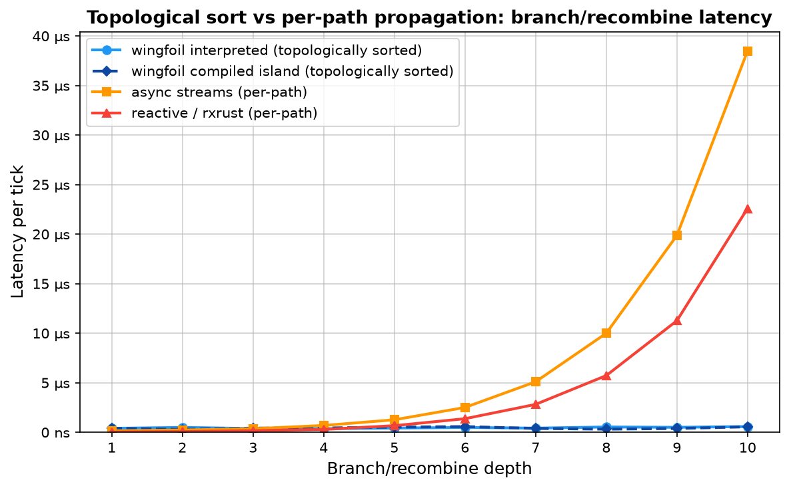
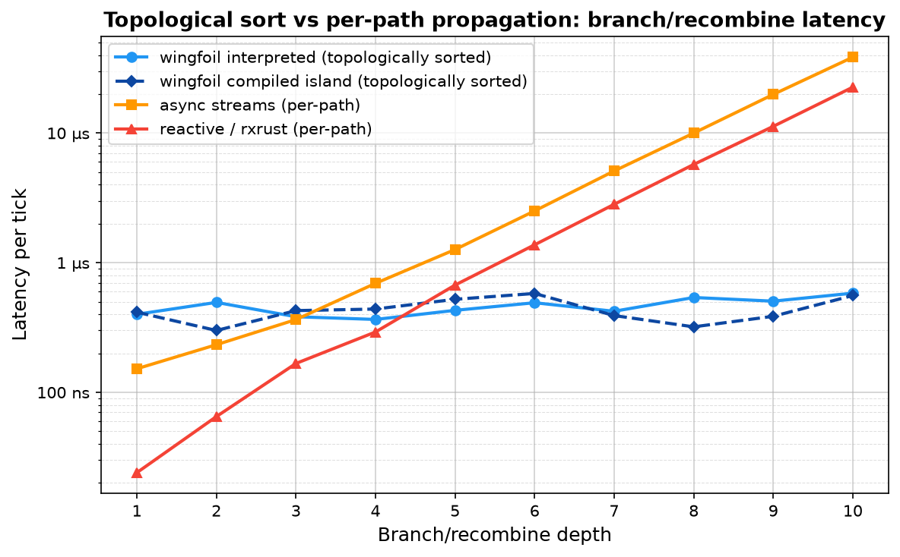
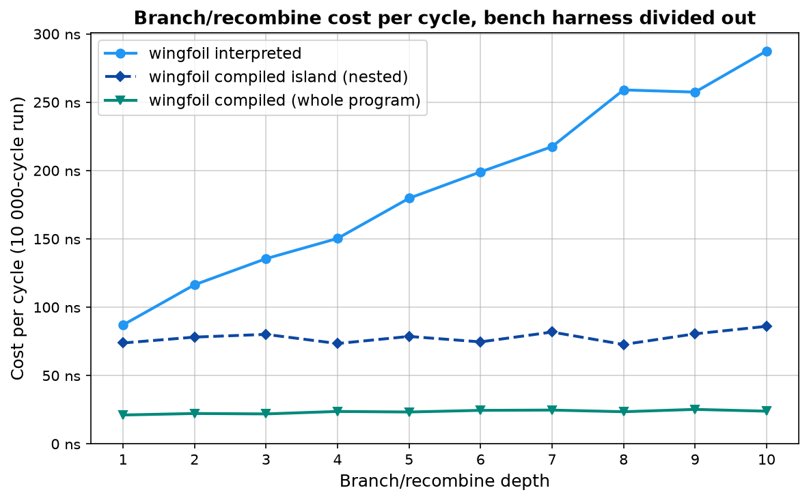
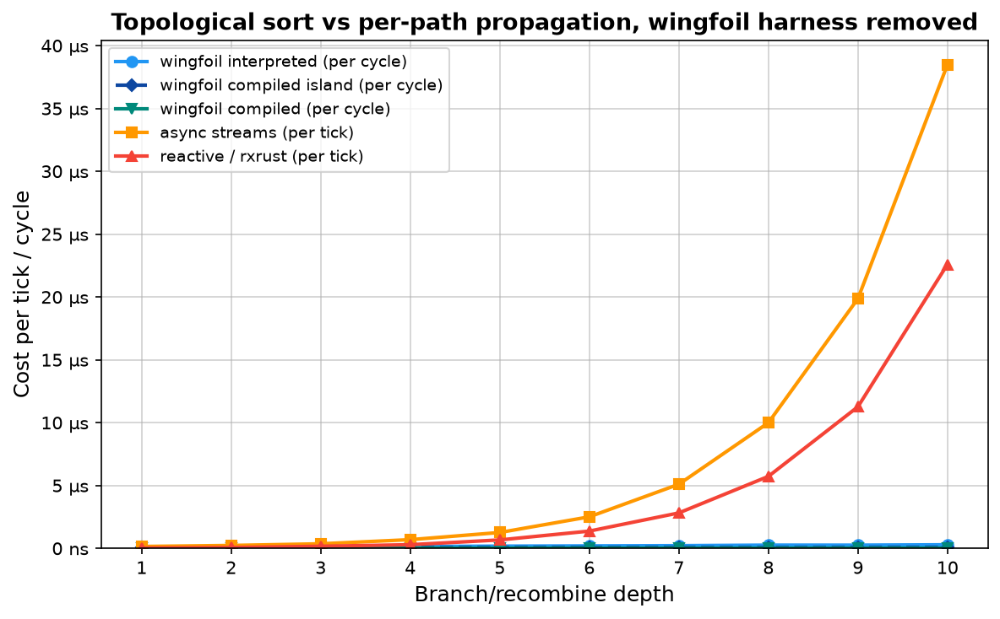
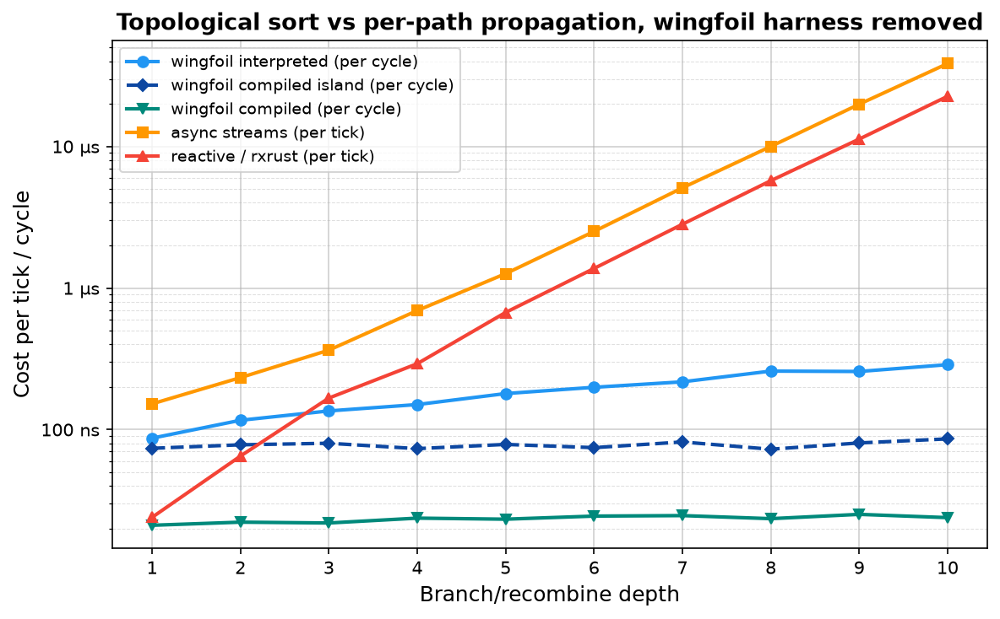

## Topological Sort vs Per-Path Propagation: Branch / Recombine Benchmark

Port of `legacy/wingfoil/benches/bfs_vs_dfs/README.md` onto the next engine.

These benchmarks measure the cost of the branch/recombine pattern at depths 1–10:


At depth N the graph has 2^N paths from source to sink. The execution model
determines whether a framework pays O(N) or O(2^N) per tick.

### Results



wingfoil stays flat while async streams and reactive double every level
(O(2^N) per-path propagation). The linear axis is what makes the doubling look
like doubling — but it also flattens every wingfoil series onto the floor and
compresses the first four depths into nothing, so here is the same data on a
log axis, where the low end is legible and the crossovers are visible:



Point estimates, in nanoseconds per tick:

| Depth | wingfoil interpreted | wingfoil compiled island | rxrust (per-path, 2 emissions/sample) | tokio async (per-path) |
|---|---|---|---|---|
| 1  | 400 | 415 | 24 | 152 |
| 2  | 494 | 300 | 65 | 233 |
| 3  | 383 | 427 | 167 | 364 |
| 4  | 365 | 439 | 292 | 693 |
| 5  | 429 | 522 | 672 | 1 263 |
| 6  | 491 | 579 | 1 374 | 2 509 |
| 7  | 422 | 391 | 2 820 | 5 100 |
| 8  | 539 | 320 | 5 727 | 9 996 |
| 9  | 505 | 386 | 11 266 | 19 869 |
| 10 | 582 | 558 | 22 595 | 38 487 |

Both path-at-a-time libraries start out *ahead* — at depth 1 there is almost no
graph to schedule, and wingfoil is paying the bench harness's fixed handshake
(~310 ns of it; [see below](#the-graphs-own-cost-with-the-harness-divided-out),
and [`../README.md`](../README.md#graph-overhead) for the floor on its own). They
cross over by depth 5 (rxrust) and depth 4 (async streams), then double every
level — 2.01× and 1.94× per level measured over the sweep — while both wingfoil
tiers stay put: by depth 10 they are **~39× (rxrust) and ~66× (async streams)**
behind the interpreted engine. Extending the same slopes to depth 20 puts the
gap in the millions.

**Only the wingfoil columns pay a handshake, so this table understates the
engine.** `add_bench` runs the graph on a worker thread and hands off through a
spinning `AtomicU8` — two `SeqCst` round-trips and a cross-core cache-line
transfer per sample. [`reactive.rs`](reactive.rs) and
[`async_streams.rs`](async_streams.rs) call straight into the library on the
criterion thread and have no equivalent cost; their floor is criterion's own
loop overhead. All four series are timed by the same *tool*, not in the same
*way*. The error runs in the baselines' favour, so nothing above is at risk —
but the quoted crossovers are later than the engine's real ones and the depth-10
ratios are lower bounds. The
[harness-free comparison](#the-same-comparison-with-the-wingfoil-handshake-removed)
puts numbers on both.

**The rxrust column is two source emissions per sample**, not one.
[`reactive.rs`](reactive.rs) calls `root.next` twice per `iter()` — the second
is what makes each level double, since `combine_latest(src, src)` emits once on
the first push and twice thereafter — where `add_bench`'s `step()` drives one
graph tick and [`async_streams.rs`](async_streams.rs)'s `block_on` evaluates one
value. Per source event the rxrust ratios here are about **half** what the table
implies (~20× at depth 10, not 39×). Left as the legacy target wrote it so the
two readings stay comparable; the slopes — linear against doubling, which is the
actual claim — are untouched by the factor.

**`async_streams.rs` is not a stream, and barely a tokio measurement.** It is
recursive `Box::pin(async move …)` over an immediately-ready leaf, so nothing
ever yields and the scheduler is uninvolved past `block_on` — what doubles is
2^(N+1)−1 heap allocations plus poll dispatch, and `block_on`'s own per-sample
cost sits on top. It is an honest depiction of *per-path propagation*, which is
what the comparison is about, and it is not a claim about the best an async
implementation could do on this DAG.

The two wingfoil series are the same `nitro!` wiring on two engines — the
interpreted graph and the same DAG mounted as a single compiled island — and
neither trends with depth. **Do not read a per-depth figure off either of
them.** Most of each sample is the handshake, and the residue is noisy enough to
swamp the graph: the interpreted series wanders between 365 and 582 ns across a
sweep whose true cost (next section) moves by ~200 ns, and subtracting the two
harnesses depth by depth implies a "fixed" floor anywhere from 204 to 378 ns.
Neither series trends, and both are non-monotonic in depth — the island reads
415 ns at depth 1 and 300 ns at depth 2, which no amount of added nodes can
explain. Treat every cell here as the harness plus noise; the separation
between the tiers is quantified in the next section, where the handshake is
gone.

#### The graph's own cost, with the harness divided out

The `cycles_depth_N` groups run the same graphs with the driving ticker *inside*
the `nitro!` block ([`src_depth_N`](wingfoil.rs)) for a fixed 10 000 cycles, so
no handshake sits under the measurement. Whole-run time divided by the cycle
count, in nanoseconds per cycle:

| Depth | Nodes | interpreted | compiled | compiled island |
|---|---|---|---|---|
| 1  | 4  | 87.0  | **21.1** | 73.8 |
| 2  | 5  | 116.4 | **22.2** | 78.1 |
| 3  | 6  | 135.5 | **21.9** | 80.1 |
| 4  | 7  | 150.3 | **23.7** | 73.4 |
| 5  | 8  | 179.7 | **23.3** | 78.6 |
| 6  | 9  | 199.0 | **24.5** | 74.6 |
| 7  | 10 | 217.5 | **24.7** | 81.8 |
| 8  | 11 | 259.0 | **23.5** | 72.7 |
| 9  | 12 | 257.4 | **25.2** | 80.5 |
| 10 | 13 | 287.5 | **23.9** | 86.0 |
| *least squares* | | 68 + **22.0**·d | 21 + **0.35**·d | 74 + **0.67**·d |



**All three tiers are here and only here**, and the reason is the harness rather
than the workload. `add_bench` has to feed the graph from the criterion thread,
so the `latency` blocks take a trigger input, and `nitro!` emits an input-taking
graph as a component (`wire` + `nested`) and never as a standalone program.
These groups drive from a ticker, a ticker can live inside the block, and a
self-contained graph is exactly what `compiled()` requires. Same node count
either way — ticker + `count` + `map` + N joins — so the two sweeps are wiring
the identical DAG.

Four things this harness shows that the per-tick one cannot:

- **What the per-tick chart's flat line is made of.** At depth 1 the same graph
  costs 400 ns per tick and 87 ns per cycle, so the bulk of that sample is the
  criterion↔worker handshake, not the engine — consistent with
  [`../graph.rs`](../graph.rs)'s `node` bar, which wires no graph at all and
  measures the handshake on its own. Taking the same difference at every depth
  gives 204–378 ns rather than one number, so treat the floor as "a few hundred
  nanoseconds, noisy" and not as a constant worth subtracting from individual
  samples. That floor is why the wingfoil series reads as flat well before the
  graph is, and it is a cost **only wingfoil pays** — the cross-library table
  above is conservative by that margin.
- **The O(N) claim, as a number.** Least squares over the ten depths puts the
  interpreted engine at **≈ 68 ns + 22.0 ns × depth**: one more level is one more
  node and a fixed ~22 ns, every tick. Across the sweep the path count grows
  512-fold (2 → 1024) while the cost grows 3.3×. Node-cycle throughput is the
  same claim read sideways — it sits at ~46 M/s regardless of depth, i.e. cost
  tracks node count, not path count.

  The two previous captures read ≈ 97 + 22 ns × depth and ≈ 55 + 21.8 ns × depth.
  **The slope is what the claim rests on, and across three captures it has not
  moved.** The intercept is the part that wanders with the machine and with the
  wall-clock work (`Kernel::wall_time` became lazy between the first two).
- **The whole-program tier is ~22 ns for the entire graph, at any depth** —
  21.1 ns at depth 1, 23.9 ns at depth 10, a marginal 0.35 ns per level. That is
  roughly what the *interpreter* pays for one node. At depth 10 it is 12.0× the
  interpreter and 3.6× the island, and its throughput climbs 190 → 545 M
  node-cycles/s across the sweep purely because nodes get added and wall time
  does not move.
- **The island is flat too, but pays a boundary** — 73.8 ns at depth 1, 86.0 ns
  at depth 10, marginal 0.67 ns per level. Its interior is the *same*
  monomorphized code `compiled()` emits, so the ~55 ns separating the two lines
  is entirely the island's boundary: one outer dyn call, the private
  `TimeQueue`, the mini `begin_cycle` per activation. That is a fixed cost and
  these graphs are 4–13 nodes, so there is nothing to amortise it against —
  the same reason [`../tiers.rs`](../tiers.rs) reports its thinnest island
  margin (1.0×) on `accumulate`, its 3-node workload. The island is not weak
  here; the workload is too small to pay for a boundary.

  Against the interpreter it leads 1.18× at depth 1 and 3.3× at depth 10, and
  the gap widens because only one of the two lines has a slope.

Note the added work is genuinely *executed*, not optimized away: every level's
sum passes through `black_box`, which [`wingfoil.rs`](wingfoil.rs)'s module doc
puts there specifically so the compiled tiers cannot notice that summing one
value 2^N times is a shift and collapse the whole chain. What compilation
removes is the *dispatch* around the add — the interpreter's ~22 ns of dyn call,
`RefCell` borrow and slot clone — not the add.

The island line used to read ≈ 153 ns + 31 ns × depth — *steeper* than the
interpreter's — because every inner node snapped its own `NanoTime::now()`
(~24 ns, see the [`nanotime`](../README.md#the-clock) bench) when its
`Ctx::nested` was built. The island now shares the outer cycle's wall snap. If
you are comparing against a capture from before that fix, that is the whole
difference. Its numbers also shifted slightly in this capture against the last
one, because the ticker moved inside the island when these groups became
self-contained; compare within a table, not across to an older one.

#### The same comparison, with the wingfoil handshake removed



Again linear for the shape, and log for the detail — on a linear axis all three
wingfoil tiers are one line on the floor, which is the point being made and
also why the second chart exists. The log axis is the only place the ~55 ns
between `compiled` and the island is visible at all, and the only place you can
see rxrust starting *ahead* at depths 1–2:



The table at the top is the measurement the three targets actually make, and it
is the only one where every series is timed identically. It is also conservative:
wingfoil pays a cross-thread handshake there and the baselines pay nothing. This
chart puts the harness-free wingfoil tiers against the same two baselines —
mixed harnesses, so read the *slopes*, and take the ratios with the caveat
attached:

| Depth | interpreted | compiled | island | rxrust | tokio async |
|---|---|---|---|---|---|
| 1  | 87.0 | 21.1 | 73.8 | 24 | 152 |
| 3  | 135.5 | 21.9 | 80.1 | 167 | 364 |
| 5  | 179.7 | 23.3 | 78.6 | 672 | 1 263 |
| 7  | 217.5 | 24.7 | 81.8 | 2 820 | 5 100 |
| 10 | 287.5 | 23.9 | 86.0 | 22 595 | 38 487 |
| *vs rxrust @ 10* | 78.6× | **945×** | 263× | 1× | — |
| *vs tokio @ 10* | 134× | **1610×** | 448× | — | 1× |

The crossovers quoted from the first table — depth 5 for rxrust, depth 4 for
async — are largely harness artifact. Against the engine's own cost the
interpreter passes rxrust at **depth 3** and is ahead of tokio from **depth 1**;
the compiled tiers lead everything, everywhere.

Two readings of the same data, and they answer different questions. At depth 1
there is no branching to exploit and the gap is the *runtime* difference:
compiled 21.1 ns against tokio's 152 ns, **~7×**. At depth 10 the gap is the
*algorithmic* difference — O(N) against O(2^N) on a workload built to expose
it — and it is 1610×, unbounded in depth. Both are real; quote the one that
matches the claim being made, and halve the rxrust figures for a per-source-event
reading.

This is a *reading*, not source — measured on **machine B**, the 4-core 2.10 GHz
Xeon KVM guest described in [`../images/lscpu-b.txt`](../images/lscpu-b.txt), as
is the tier suite; the rest of [`../README.md`](../README.md) is still machine A.
Every series here was measured on B back to back, which is what makes them
comparable to each other and not to a table captured elsewhere. Regenerate
locally by running the three targets and refilling `plot.py` (the script's header
lists the commands). The
legacy-engine plot, on the same workload, is preserved at
[`legacy/wingfoil/benches/bfs_vs_dfs/latency.png`](../../../../legacy/wingfoil/benches/bfs_vs_dfs/latency.png)
until the Phase-7 cutover.

### Why the difference?

**Per-path propagation (reactive / async):** when a source ticks, it fires
both arms of `combine_latest(src, src)` independently. Each arm triggers the
next level, which again fires both arms — 2^N callbacks or awaits across N
levels.

**Topological sort (wingfoil):** the graph is sorted so that every node is
scheduled after everything it reads, and the scheduler visits each node
exactly once per tick regardless of how many upstream paths lead to it. The
entire depth-127 graph in the
[topological_sort example](../../examples/core/topological_sort/) completes in
a single engine cycle.

### Benchmarks

| File | Framework | Pattern |
|------|-----------|---------|
| [wingfoil.rs](wingfoil.rs) | wingfoil | `s.join(&s, \|a, b\| a + b)` per level, two `nitro!` blocks per depth — one taking a trigger (interpreted + island, per tick), one self-contained (all three tiers, per cycle) |
| [async_streams.rs](async_streams.rs) | tokio async/await | recursive `branch_recombine` |
| [reactive.rs](reactive.rs) | rxrust 1.0 | `Subject` chain + `combine_latest` |

Only the first row changes across the port — the other two measure *other
libraries* as comparison baselines and are engine-agnostic, so their code is a
verbatim copy of the legacy files (only the wording of their header comments
differs). `wingfoil.rs` keeps the legacy workload node-for-node; legacy's free
function `add(&a, &b)` (a `bimap` with both upstreams active) is next's
`join`, one node per level either way. Its own module doc lists the rest of the
deviations — the `nitro!` unrolling, the `black_box` fences that stop the
compiled tiers collapsing 2^N additions of one value into a shift, and the
second set of self-contained blocks that the `compiled()` tier requires.

### Running

The bench targets keep their historical names:

```bash
cargo bench --manifest-path crates/wingfoil/Cargo.toml --features bench --bench bfs_vs_dfs_wingfoil
cargo bench --manifest-path crates/wingfoil/Cargo.toml --bench bfs_vs_dfs_reactive
cargo bench --manifest-path crates/wingfoil/Cargo.toml --features async --bench bfs_vs_dfs_async_streams
```

The wingfoil target runs both harnesses; criterion's filter picks one:

```bash
cargo bench --manifest-path crates/wingfoil/Cargo.toml --features bench --bench bfs_vs_dfs_wingfoil -- 'depth_\d+(_nested)?$'
cargo bench --manifest-path crates/wingfoil/Cargo.toml --features bench --bench bfs_vs_dfs_wingfoil -- cycles_
```
