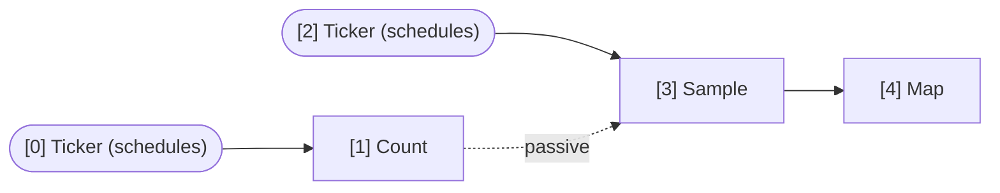

## Seeing the graph you wired

A wingfoil graph is written as a chain of combinators, which makes some facts
about it hard to see in the source — most of all **which edges propagate ticks
and which are only read**. `sample` is the classic case: it reads its data leg
passively and fires on its trigger leg, and nothing about `price.sample(&clock)`
tells you which is which.

`GraphBuilder::snapshot()` captures the wired topology as data, without running
anything. It does not consume the builder, so you can take one at any point
during wiring; `Runner::snapshot()` does the same after `build()`.

```rust
let price = g.ticker(Duration::from_millis(1)).count();
let clock = g.ticker(Duration::from_millis(10));
let sampled = price.sample(&clock);
let _doubled = sampled.map(|n: &u64| n * 2);

let snap = g.snapshot();
println!("{snap}");
```

Five renderings, for five different places you want the graph to land:

| Method | For |
|---|---|
| `to_text()` (also `Display`) | A terminal or a test failure. `<-` active, `<~` passive. |
| `to_mermaid()` | A README, an issue or a pull request — GitHub renders it inline. |
| `to_dot()` | Graphviz. The best layout of the five for a wide DAG: pipe to `dot -Tsvg`. |
| `to_json()` | Another tool. Deserializes straight back into a `GraphSnapshot`. |
| `to_gml()` | yEd / Gephi, and continuity with legacy wingfoil's `Graph::export`. |

The snapshot is *structure only* — no values, no tick counts, no timings. Those
need a running graph and cost something to collect, so they belong to a separate
opt-in surface; see [`docs/planning/introspection-plan.md`](../../../../../docs/planning/introspection-plan.md).

## Run

```sh
cargo run --manifest-path crates/wingfoil/Cargo.toml --example introspect
```

## Output

```text
wingfoil graph: 5 nodes, 4 edges
  [0] Ticker (schedules)
  [1] Count <- 0
  [2] Ticker (schedules)
  [3] Sample <- 2 <~ 1
  [4] Map <- 3

sources: [0, 2]
sinks:   [4]
```

Node 3 is the `sample`, and its two upstreams are marked differently: `<- 2`
says the slow clock **activates** it, `<~ 1` says it **reads** the fast count
without being triggered by it. Both tickers are sources; only the `map` at the
end is a sink.

The Mermaid rendering of the same graph, which GitHub draws:



Sources are drawn as stadiums, passive edges dotted and labelled. To render the
DOT form instead:

```sh
cargo run --manifest-path crates/wingfoil/Cargo.toml --example introspect \
  | sed -n '/digraph/,/^}/p' | dot -Tsvg > graph.svg
```
