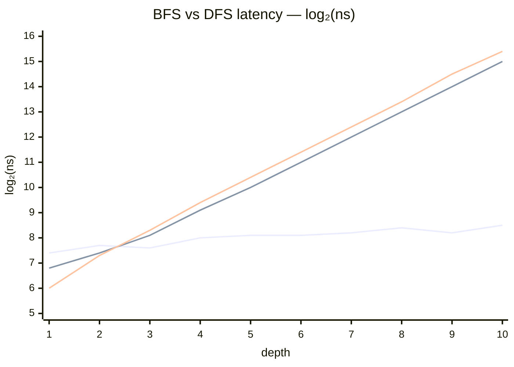

## BFS vs DFS: Branch / Recombine Benchmark

These benchmarks measure the cost of the branch/recombine pattern at depths 1–10:

```
source → add(source, source) → add(…, …) → … (N levels)
```

At depth N the graph has 2^N paths from source to sink. The execution model
determines whether a framework pays O(N) or O(2^N) per tick.

### Results

Y-axis is log₂(nanoseconds) so each step up represents a doubling in time.



- **Flat line** — wingfoil (O(N), BFS)
- **Rising lines** — async streams and reactive (O(2^N), DFS); slope ≈ 1 per level means latency doubles each level

Reactive and async streams double every level — clear O(2^N). Wingfoil stays
flat — O(N).  At depth 10 reactive is ~120× slower than wingfoil; at depth 20
it would be ~3 million times slower.

### Why the difference?

**Depth-first (reactive / async):** when a source ticks, it fires both arms of
`combine_latest(src, src)` independently. Each arm triggers the next level,
which again fires both arms — 2^N callbacks or awaits across N levels.

**Breadth-first (wingfoil):** the graph scheduler visits each node exactly
once per tick regardless of how many upstream paths lead to it. The entire
depth-127 graph in the [breadth_first example](../../examples/breadth_first/)
completes in a single engine cycle.

### Benchmarks

| File | Framework | Pattern |
|------|-----------|---------|
| [wingfoil.rs](wingfoil.rs) | wingfoil | `add(&src, &src)` via `add_bench` |
| [async_streams.rs](async_streams.rs) | tokio async/await | recursive `branch_recombine` |
| [reactive.rs](reactive.rs) | rxrust 1.0 | `Subject` chain + `combine_latest` |

### Running

```bash
cargo bench --bench bfs_vs_dfs_wingfoil --features async
cargo bench --bench bfs_vs_dfs_reactive
cargo bench --bench bfs_vs_dfs_async_streams --features async
```
