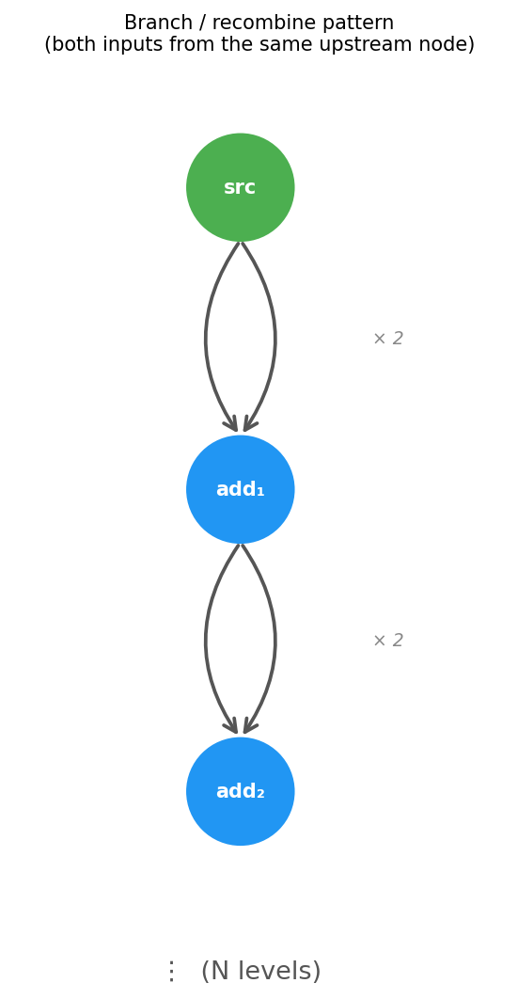
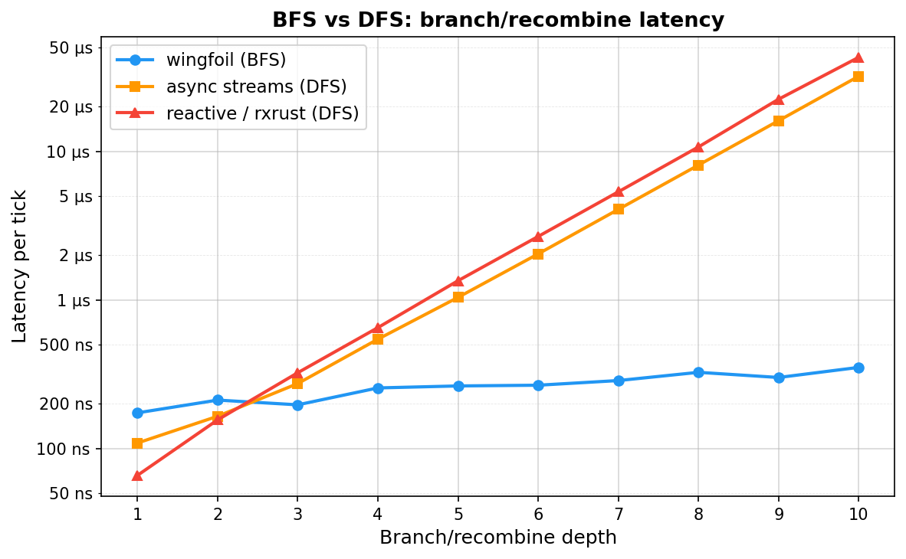

## Graph Execution

Wingfoil uses breadth-first graph execution, which eliminates the O(2^N)
explosion that affects depth-first frameworks (reactive libraries, async streams)
when nodes branch and recombine.



Each `add(&source, &source)` branches the upstream node into two inputs and
recombines them. Depth-first frameworks visit every path through the graph —
2^N paths at depth N. Wingfoil's BFS scheduler visits each node exactly once
per tick, regardless of how many upstream paths lead to it.

```rust
use wingfoil::*;

let mut source = constant(1_u128);
for _ in 0..127 {
    source = add(&source, &source);
}
let cycles = source.count();
cycles.run(RunMode::HistoricalFrom(NanoTime::ZERO), RunFor::Forever)
    .unwrap();
println!("cycles {:?}", cycles.peek_value());
println!("value {:?}", source.peek_value());
```

127 levels deep — 2^127 as the correct answer — completes in **1 tick** in under 10µs:

```
1 ticks processed in 7.207µs, 7.207µs average.
value 170141183460469231731687303715884105728
```

This also eliminates reactive glitches (inconsistent intermediate state from
nodes seeing a mix of old and new values in the same tick). See
[Wikipedia](https://en.wikipedia.org/wiki/Reactive_programming#Glitches) for
background.

### Benchmarks

The [`bfs_vs_dfs`](../../benches/bfs_vs_dfs/) benchmarks measure wingfoil,
rxrust, and async streams side-by-side at depths 1–10:



Both depth-first approaches double in cost every level. Wingfoil stays flat.
